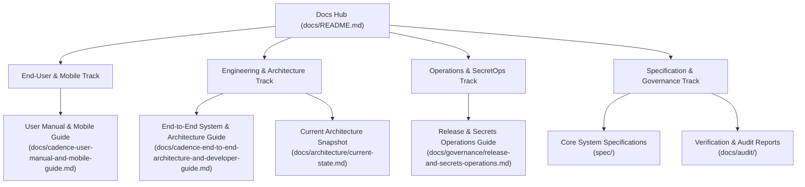

# Cadence Documentation Hub

> **Documentation Standard:** Diataxis Framework (Tutorials, How-To Guides, Reference, Explanation)  
> **Repository:** `Driftloom/Cadence-Task-OS`  
> **Production Frontend:** `https://cadence-task-os.vercel.app`  
> **Production Backend:** `https://cadence-task-os.onrender.com`  
> **Database:** Supabase PostgreSQL (`aws-0-ap-south-1`)

Welcome to the canonical documentation library for **Cadence (Personal Task & Time OS)**. This directory contains comprehensive documentation covering both day-to-day user operations and deep engineering architecture.

---

## 1. Documentation Map & Navigation



---

## 2. Recommended Reading by Role

### 📱 For Everyday Users & Mobile Device Operators
If you are using Cadence to organize your tasks, schedule time blocks, or run Pomodoro focus sessions:
* **Primary Guide:** [`cadence-user-manual-and-mobile-guide.md`](./cadence-user-manual-and-mobile-guide.md)
  * **Chapter 1:** Installing on iPhone (Safari PWA), Android (Chrome PWA), and Standalone APK.
  * **Chapter 2:** The 5-Step Enterprise Onboarding Tour (Timezone, Rhythm, Quiet Hours).
  * **Chapter 3:** Friction-Free Capture, Keyboard Shortcuts (`N`, `Cmd+K`), and Natural Language Syntax.
  * **Chapter 4:** The `/today` Command Center, Next Up card, and Activity Rings.
  * **Chapter 5:** Deep Work with Focus Rounds, Web Audio cues, and background timer survival.
  * **Chapter 6:** Calendar Time-Blocking, 24-hour grid, and Fixed vs Flexible blocks.
  * **Chapter 7:** The 9-Rule Auto-Reschedule Engine, automation dials (Off / Ask / Auto), and 1-click Undo.
  * **Chapter 8:** Guided Daily Rituals ("Plan My Day" and "Close My Day") with strict streaks.
  * **Chapter 9:** Two-Way Telegram Bot Companion (`done`, `snooze 1h`, `list today`).
  * **Chapter 10:** Memory Transparency Screen (`/memory`) and Human-in-the-Loop confirmation.
  * **Chapter 11:** Zero Data Loss, TanStack Query persistence, and the Activity History ledger.
  * **Chapter 12:** Frequently Asked Questions & Troubleshooting.

---

### 💻 For Software Engineers & System Architects
If you are developing features, extending the API, modifying database schemas, or debugging backend routines:
* **Primary Guide:** [`cadence-end-to-end-architecture-and-developer-guide.md`](./cadence-end-to-end-architecture-and-developer-guide.md)
  * **Section 1:** System Overview, Invariants, and Request Lifecycle with `runWithRls`.
  * **Section 2:** Data Model, ER Diagram, Table Specs (`tasks`, `time_blocks`, `focus_sessions`, `memory_facts`), and Indexing.
  * **Section 3:** Universal Timezone normalization (`Asia/Kolkata`), 9-Rule Reschedule Engine, 3-Tier Agent Memory, and Activity History.
  * **Section 4:** API Route Catalogue (19 mounted Express 5 routers) and Internal Dispatch Security.
  * **Section 5:** Operational Runbooks: 9-Gate Verification Ladder, CLI Deployments, Infisical SecretOps, and APK packaging.
  * **Section 6:** Tutorial: First 15 Minutes with Cadence.
* **Architecture Evidence Snapshot:** [`architecture/current-state.md`](./architecture/current-state.md)
  * Formal `ln-22` evidence snapshot documenting monorepo package boundaries, all 16 applied database migrations (`0000`–`0015`), and live edge proxying.

---

### 🔐 For DevOps, Infrastructure & Secret Management
If you are managing deployments, environment configurations, or secret vaults:
* **Release & Secrets Guide:** [`governance/release-and-secrets-operations.md`](./governance/release-and-secrets-operations.md)
  * Infisical CLI authentication and encrypted secret synchronization (`Vacloom / cadence`).
  * Vercel production deployment and proxy rewrites (`vercel.json`).
  * Render backend deployment and UptimeRobot keepalive monitoring.
  * Supabase `pg_cron` / `pg_net` background job configuration.

---

## 3. Directory Layout

```
docs/
├── README.md                                             # This index hub
├── cadence-user-manual-and-mobile-guide.md               # User & mobile documentation
├── cadence-end-to-end-architecture-and-developer-guide.md # Architecture & engineering guide
├── architecture/
│   └── current-state.md                                  # ln-22 architecture snapshot
├── audit/
│   ├── 2026-09-19-zero-trust-audit-report.md             # Baseline zero-trust audit
│   ├── 2026-09-30-design-system-audit/                   # Design system & token baseline
│   └── 2026-10-05-documentation-audit.md                 # ln-53 documentation & release audit
├── governance/
│   ├── database-operations.md                            # Migration runner & advisory locking runbook
│   ├── editor-migration-guide.md                         # AI coding environment migration guide
│   ├── release-and-secrets-operations.md                 # Infisical & CLI release runbook
│   └── zero-trust-audit-prompt.md                        # Weekly audit prompt
├── research/
│   ├── critical-gaps-diagnosis.md                        # Personal automation failure modes analysis
│   └── product-vision-and-prior-art.md                   # Market teardown & philosophy
└── archive/                                              # Historical 01-12 research & specs
```

---

## 4. Documentation Quality & Invariants

All documentation in this repository adheres to three non-negotiable principles:
1. **Zero-Trust Factual Integrity:** Every URL, port number, migration range, and code snippet reflects the actual, tested repository state. No synthetic mocks or placeholder data.
2. **Mermaid Rendering Guarantee:** Every Mermaid diagram across the documentation suite is validated and syntax-checked against the official Mermaid parser.
3. **No Process Residue:** Documentation is written directly as permanent, authoritative reference material for human readers and AI assistants, free from transient scratch text.

---

*Cadence Documentation Suite — Maintained by Rohit & the Cadence Engineering Team.*
