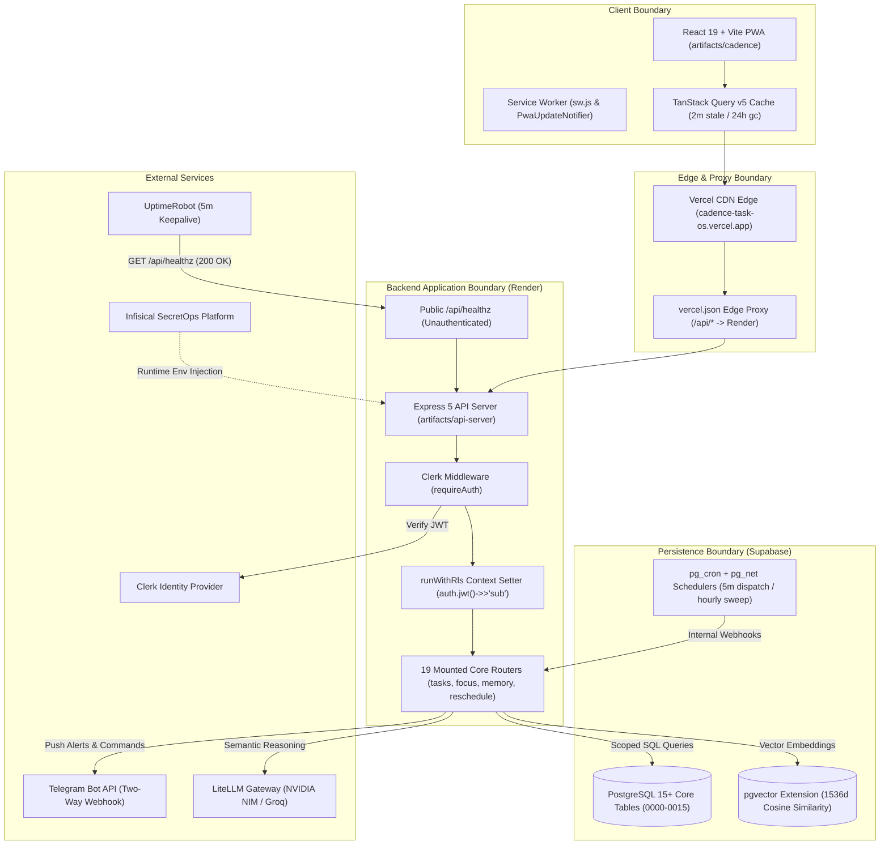
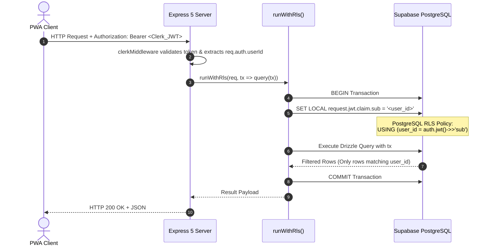
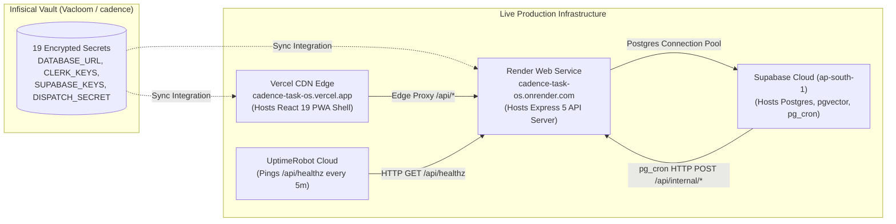

# Current Architecture Snapshot: Cadence Task OS

> **Standard:** `ln-22-current-architecture-documenter`  
> **Status:** `DOCUMENTED` & Evidence-Backed  
> **Observation Date:** 2026-10-05  
> **Repository:** `Driftloom/Cadence-Task-OS`  
> **Branch:** `main` (Production Track)  
> **Live Production Endpoints:**  
> - Frontend: `https://cadence-task-os.vercel.app` (Vercel Edge Network)  
> - Backend API: `https://cadence-task-os.onrender.com` (Render Web Service)  
> - Database: Supabase PostgreSQL (`aws-0-ap-south-1`, pooler port 5432)

---

## 1. System Context & High-Level Topology

Cadence is a personal task and time management operating system architected as a pnpm monorepo. It features a React 19 Progressive Web Application frontend, an Express 5 REST API backend, and a Supabase PostgreSQL persistence engine utilizing Row-Level Security (RLS) driven by Clerk JWT identity claims.

---

## 2. Component Inventory & Monorepo Boundaries

| Package Path | Package Name | Role | Technology Stack |
|---|---|---|---|
| `artifacts/cadence` | `@workspace/cadence` | User-facing React Progressive Web Application. | React 19, Vite, Tailwind CSS, shadcn/ui, Radix UI, TanStack Query v5, Wouter router. |
| `artifacts/api-server` | `@workspace/api-server` | REST API service providing 19 routers and 50+ endpoints. | Express 5, esbuild CJS→ESM bundle, `@clerk/express`, Pino logger. |
| `lib/db` | `@workspace/db` | Canonical database schema, migrations, and Drizzle client. | Drizzle ORM, Postgres.js, `pgvector`, Drizzle Kit. |
| `lib/api-spec` | `@workspace/api-spec` | OpenAPI 3.1 single source of truth and contract generator. | OpenAPI 3.1, Orval CLI generator. |
| `lib/api-client-react` | `@workspace/api-client-react` | Generated TanStack Query React hooks & `customFetch` mutator. | TypeScript, TanStack React Query, Fetch API. |
| `lib/api-zod` | `@workspace/api-zod` | Generated runtime request/response validation schemas. | Zod v3. |
| `tokens` | — | Single source of truth for Apple HIG design tokens. | `tokens.json`, `build-tokens.cjs` compiler. |

---

## 3. Data Flow & Security Isolation Architecture

### 3.1 Fail-Closed Row-Level Security (RLS)
The database operates under a zero-trust model where PostgreSQL Row-Level Security is enabled on every table. The backend interacts with the database via a shared connection pool, but every transaction dynamically sets the user claim:

### 3.2 Database Migration Catalogue (0000–0015)
All 16 migrations are applied with zero drift:
* `0000_init`: Initial baseline tables (`tasks`, `focus_sessions`).
* `0001_supabase_rls_hardening`: Implements `auth.jwt()->>'sub'` policies and foreign keys.
* `0002_add_projects_and_tags`: Categorization models (`projects`, `tags`, `task_tags`).
* `0003_add_subtasks_and_files`: Parent-child task tree (`parent_id`) and attachments (`task_files`).
* `0004_add_time_blocks`: Calendar hour-grid allocations (`time_blocks`, `is_fixed`).
* `0005_add_reminders_and_notifications`: Reminder dispatch queues and user timezone settings.
* `0006_add_automation_and_focus_settings`: System automation kill switches and Pomodoro durations.
* `0007_add_reschedule_engine`: Reschedule proposals, runs, and audit tables.
* `0008_add_momentum_and_streaks`: Activity rings tracking, momentum counters, and daily streaks.
* `0009_add_agent_memory`: 3-tier memory models (`memory_facts`, `memory_semantic` with `vector(1536)`).
* `0010_add_rituals`: Morning "Plan My Day" and evening "Close My Day" logs.
* `0011_add_telegram_pairing`: Telegram user ID mapping and pairing codes.
* `0012_add_integrations_status`: External service sync health logs.
* `0013_add_natural_date_indexes`: Hot-path indexing for Chrono parsed range queries.
* `0014_add_rrule_recurrence`: RFC 5545 recurrence materialization schema.
* `0015_pg_net_hardening`: Hardened `pg_net` async HTTP execution permissions for cron jobs.

---

## 4. Critical Runtime Subsystems

### 4.1 Universal Time & Timezone Normalization
* **Contract:** All dates are stored as UTC timestamps in Postgres.
* **Wall-Clock Standard:** Untimed tasks (e.g. "Due Today") are anchored to `00:00:00.000` in the user's IANA timezone (`notification_settings.timezone`, default `Asia/Kolkata`).
* **Client Translation:** `date-utils.ts` uses `Intl.DateTimeFormat('en-CA', { timeZone })` to guarantee that formatting and input slicing (`toLocalDatetimeInput`) never introduce multi-hour daylight saving or offset shifts.

### 4.2 The 9-Rule Auto-Reschedule Engine
Operates via hourly `pg_cron` jobs calling `POST /api/internal/reschedule` with `x-dispatch-secret`:
1. Rule 1: Never moves `is_fixed = true` calendar blocks.
2. Rule 2: Proposed time must be `>= now()`.
3. Rule 3: Must fall inside configured `working_hours` (e.g. `09:00–18:00`).
4. Rule 4: Never schedules inside `quiet_hours`.
5. Rule 5: Ceases auto-moving after 5 attempts (`reschedule_count >= 5`), flagging `needs_attention = true`.
6. Rule 6: `auto` dial automatically downgrades to `ask` on second consecutive miss.
7. Rule 7: Every mutation logs an audit record to `reschedule_runs` and `activity_history`.
8. Rule 8: High priority tasks claim earlier slots.
9. Rule 9: Queries `memory_facts` for the user's task duration multiplier (e.g. 1.3×) before allocating calendar block length.

### 4.3 3-Tier Agent Memory Subsystem
* **Tier 1 (In-Context):** Active session dialogue window in `/agent`.
* **Tier 2 (Semantic):** `memory_semantic` table indexed with `pgvector` (`vector_cosine_ops`, 1536 dimensions) for historical task notes retrieval.
* **Tier 3 (Structured Facts):** `memory_facts` JSONB records. Source A (arithmetic duration multipliers) auto-commits; Source B (conversational facts) requires user confirmation via the `/memory` UI before activation.

---

## 5. Deployment Topology & SecretOps Architecture

---

## 6. Verification Ladder & Quality Gates

The codebase enforces a 9-gate quality ladder executed via `node scripts/run-gates.cjs`:
1. `typecheck`: TypeScript composite project compilation (`tsc --build`).
2. `tokens`: Verifies `tokens/tokens.json` synchronization against emitted CSS variables.
3. `lint:tokens`: Scans codebase for off-system hex literals or arbitrary CSS values.
4. `contrast`: Enforces WCAG 1.4.3 (4.5:1 text) and 1.4.11 (3:1 control) ratios for both dark and light modes.
5. `codegen`: Asserts OpenAPI specification matches generated Orval and Zod client code.
6. `build:api`: Bundles Express 5 into `artifacts/api-server/dist/index.mjs`.
7. `build:web`: Bundles production Vite PWA into `artifacts/cadence/dist/public`.
8. `encoding`: Enforces UTF-8 character integrity across 500+ source files (`scan-mojibake.cjs`).
9. `test`: Executes 600+ Vitest unit and integration suites across all workspace packages.

---

*Current Architecture Snapshot verified against live repository state and production endpoints.*
