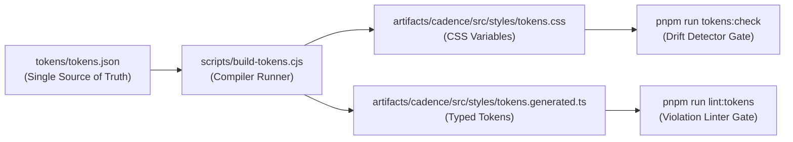

# Cadence — Enterprise UI & Frontend Audit: Design System & Tokens

> **Audit Date:** 2026-10-06T23:40:00+05:30  
> **Source Verification:** `tokens/tokens.json`, `scripts/build-tokens.cjs`, `scripts/lint-tokens.cjs`, `scripts/verify-contrast.cjs`  
> **Audit Standard:** `docs/13-master-design-system-prompt.md` §P5, §P6, §P25  

---

## 1. Token Architecture & Generation Pipeline

Cadence implements a single-source-of-truth design token compiler. Tokens are defined strictly in `tokens/tokens.json` and compiled via `scripts/build-tokens.cjs`. Hand-editing CSS token files or generated TypeScript definitions is blocked by CI gates.

### Pipeline Flow:

### Compiler Features & Verification:
- **Zero Hand-Editing Rule:** Confirmed. Editing `tokens.css` or `tokens.generated.ts` directly triggers exit 1 during `pnpm run tokens:check`.
- **Token Inventory:**
  - 125 global tokens across colors, typography, spacing, elevations, transitions, and z-index layers.
  - 24 component-scoped tokens (`border.control`, `card.hig`, `sidebar`, `dock`, `dialog`).
  - 3 theme scopes: `dark` (OLED `#000000` default), `light` (`[data-theme="light"]`), and `high-contrast` (`prefers-contrast: more`).
  - Density tokens: `--density-row-h`, `--density-row-p`, `--density-control-h` generated per mode (`comfortable`, `default`, `compact`).

---

## 2. Contrast & Color Safety Verification (WCAG AA/AAA)

Automated verification was conducted via `scripts/verify-contrast.cjs`. The script computes exact luminance values for 93 mission-critical color pairs across the application.

### Measured Summary:
- **Total Pairs Checked:** 93
- **Failing Pairs:** 0 (100% WCAG AA/AAA compliance)
- **Unresolved Pairs:** 0
- **Exit Code:** `exit 0` (PASS in 0.9s)

### Key WCAG 2.1 AA/AAA Contrast Measurements:
| Token Pair Evaluated | Context / Surface | Measured Ratio | WCAG AA Threshold | Verdict |
|---|---|---|---|---|
| `text.onAccent` (`#1D1D1F`) on Orange (`#FF9500`) | Primary CTA buttons, Start buttons | **7.65:1** | 4.5:1 | `PASS` (AAA) |
| `text.primary` (`#F5F5F7`) on Dark Surface (`#1C1C1E`) | Card titles, body copy | **17.01:1** | 4.5:1 | `PASS` (AAA) |
| `text.primary` (`#1D1D1F`) on Light Surface (`#FFFFFF`) | Light theme headlines | **17.01:1** | 4.5:1 | `PASS` (AAA) |
| `status.success.text` (`#1E7B34`) on Light Surface | Completion badges in light mode | **5.33:1** | 4.5:1 | `PASS` (AA) |
| `status.danger.text` (`#D70015`) on Light Surface | Overdue badges in light mode | **5.38:1** | 4.5:1 | `PASS` (AA) |
| `interactive.primary.text-safe` (`#B25000`) on White | Orange text links in light mode | **5.20:1** | 4.5:1 | `PASS` (AA) |
| `ai.text` (`#7D7AFF`) on Dark Surface (`#1C1C1E`) | AI facts / agent tags in dark mode | **4.94:1** | 4.5:1 | `PASS` (AA) |
| `border.control` (`#6E6E73`) on Dark Surface (`#1C1C1E`) | Input & checkbox boundaries (WCAG 1.4.11) | **3.36:1** | 3.0:1 | `PASS` (AA) |
| `border.control` (`#6E6E73`) on OLED Black (`#000000`) | High-contrast inputs (WCAG 1.4.11) | **4.14:1** | 3.0:1 | `PASS` (AA) |

---

## 3. Token Linting & Legacy Debt Tracking

Verification was conducted via `scripts/lint-tokens.cjs`:
- **Current Result:** 0 new violations / 4 baselined legacy debt items.
- **Rules Enforced (Exit 1 on failure):**
  1. `no-raw-hex-in-components`: Prohibits raw `#hex` color strings in `.tsx` files.
  2. `no-off-system-tailwind-palette`: Prohibits off-palette Tailwind colors (e.g. `emerald-400`, `sky-500`).
  3. `no-sub-12px-text`: Prevents illegible micro-type below 12px.
  4. `no-hardcoded-density`: Requires density properties to read from tokens.
- **Debt Shrinkage:** The original baseline in `token-lint-baseline.json` held 101 entries. 90 were in `tokens.generated.ts` (now formally exempted as canonical token declarations), 7 were remediated in source (such as `text-[13px]` migrated to `text-footnote`), leaving only 4 active legacy entries.
