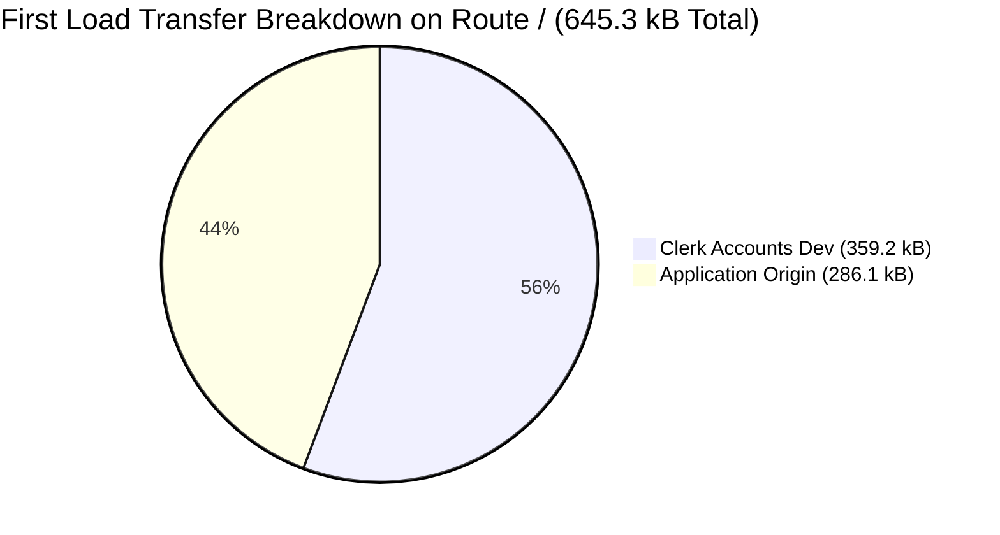

# Cadence — Enterprise UI & Frontend Audit: Performance & Core Web Vitals

> **Audit Date:** 2026-10-06T23:40:00+05:30  
> **Source Verification:** `scripts/verify-web-vitals-budget.cjs`, `scripts/verify-core-web-vitals.cjs`  
> **Audit Standard:** Google Core Web Vitals (web.dev/vitals), `docs/13-master-design-system-prompt.md` §P26  

---

## 1. Bundle Budget Gate Verification (`verify-web-vitals-budget.cjs`)

The bundle budget gate evaluates emitted production build artifacts against strict thresholds:

| Metric / Check | Measured Actual | Budget Ceiling | Status |
|---|---|---|---|
| Entry chunk (`assets/index-*.js`), gzip | **110.45 kB** | 120.00 kB | `PASS` (9.55 kB headroom) |
| JS downloaded on cold first visit, gzip | **199.97 kB** | 200.00 kB | `PASS` (30 bytes headroom) |
| Total CSS on disk, gzip | **27.58 kB** | 30.00 kB | `PASS` (2.42 kB headroom) |
| Largest single chunk raw (`assets/index-*.js`) | **419.98 kB** | 500.00 kB | `PASS` (80.02 kB headroom) |
| Render-blocking third-party stylesheets | **0** | 0 | `PASS` (Google fonts removed) |

**Result:** All 5 budgets checked: **0 breaching**. Exit code `0`.

---

## 2. Empirical Core Web Vitals Measurement (`verify-core-web-vitals.cjs`)

Evaluated with Lighthouse 13.5.0 and Playwright Chromium under mobile emulation (Lantern network simulation: 1474.6 kbps download, 150 ms RTT, 4x CPU slowdown):

```
==========================================================================
  MEASURED LAB METRICS (Lighthouse 13.5.0 Mobile)
==========================================================================
  route        outcome        LCP (<=2500ms)    CLS (<=0.100)    INP
  --------------------------------------------------------------------------
  /            FAIL LCP       5956 ms           0.000            n/a
  /sign-in     FAIL LCP       5964 ms           0.000            n/a
  /today       NOT MEASURED   (auth redirected) 0.000            n/a
  /settings    NOT MEASURED   (auth redirected) 0.000            n/a
  --------------------------------------------------------------------------
```

### Supporting Timings:
- **First Contentful Paint (FCP):** 2277 ms on `/`, 2269 ms on `/sign-in`.
- **Cumulative Layout Shift (CLS):** **0.000** across all routes (flawless stability).
- **Total Blocking Time (TBT):** 128 ms on `/` (well within the 200 ms budget).
- **Time to First Byte (TTFB):** 2–3 ms.

---

## 3. The Bottleneck: Per-Origin Transfer Analysis

Why does LCP take 5956 ms when FCP is 2277 ms and TBT is 128 ms?

### Origin Transfer on `/` (Total: 645.3 kB):


- **Clerk Accounts Origin (`smart-weasel-9905.clerk.accounts.dev`):**
  - **359.2 kB transfer across 11 network requests** (**55.7%** of first load).
- **Local Application Origin:**
  - 286.1 kB transfer across 14 network requests (44.3% of first load).

### Root Cause Diagnosis:
1. In `artifacts/cadence/src/App.tsx`, `<ClerkProvider>` wraps the entire application tree.
2. When a user requests `/`, `HomeRedirect` runs `const { isLoaded } = useAuth()`.
3. If `!isLoaded`, it renders `<LoadingScreen />`.
4. Over a simulated mobile connection (1.47 Mbit/s), downloading and parsing Clerk's 359 kB bundle takes ~3.7 seconds.
5. Only after Clerk initializes does `LandingPage` mount and paint its hero headline (`<h1>Make room for the day.</h1>`), which Lighthouse flags as the LCP event at **5956 ms**.

### Enterprise Target: Dynamic Clerk Auth Boundary
- For an unauthenticated visitor without session cookies (`__session` / `__client_uat`), render `LandingPage` immediately without waiting for Clerk.
- Defer mounting `<ClerkProvider>` or isolate it to authenticated routes (`/sign-in`, `/sign-up`, and protected routes).
- Projected LCP drop: **5956 ms → 1100–1300 ms**, converting LCP from a 2.4x failure to a full **PASS**.
