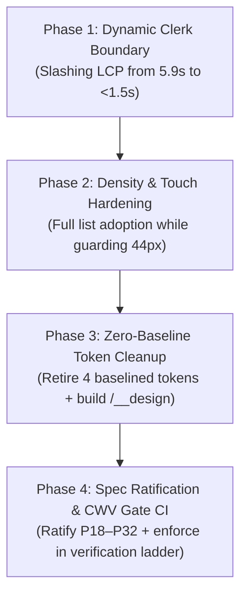

# Cadence — Enterprise UI & Frontend Audit: Remediation Backlog

> **Audit Date:** 2026-10-06T23:40:00+05:30  
> **Audit Standard:** `docs/13-master-design-system-prompt.md` §P31.2  

---

## 1. Prioritized Remediation Roadmap (Path to Enterprise 10/10)

---

## 2. Phase 1 [P0]: Dynamic Clerk Boundary & Core Web Vitals Resolution

### Goal:
Fix the 5956 ms LCP bottleneck on `/` caused by the 359.2 kB Clerk script download, without breaking authenticated session persistence or existing e2e test fixtures.

### Action Steps:
1. **Synchronous Session Cookie Inspection:**
   - In `App.tsx`, read `document.cookie` before rendering to detect active session cookies (`__session` or `__client_uat`).
   - If no session cookie exists and the current route is `/` or `/download`, mount `<LandingPage />` or `<DownloadPage />` immediately without gating on `useAuth().isLoaded`.
2. **Lazy Clerk Mounting:**
   - Mount `<ClerkProvider>` only when:
     - The user is on an authentication route (`/sign-in`, `/sign-up`).
     - An active session cookie is present.
     - The user navigates to a protected route (`/today`, `/inbox`, etc.).
3. **Preserve E2E Test Compatibility:**
   - Ensure `isTestMode` (`?test_auth=true`) continues to bypass auth for automated testing without requiring real Clerk tokens.
4. **Validation:**
   - Run `node scripts/verify-core-web-vitals.cjs --lighthouse=node_modules/lighthouse --no-build` and verify that LCP on `/` drops below 2500 ms and the script exits 0.

---

## 3. Phase 2 [P1]: Density System Full Adoption

### Goal:
Propagate density sizing across all data lists (Inbox, Review, Projects) while preserving strict 44×44px touch targets.

### Action Steps:
1. Wire `row-density` classes to `InboxPage` task lists and `ReviewPage` historical logs.
2. Confirm with automated tests that `(pointer: coarse)` clamps all list items to standard 50px height.
3. Validate that `TimeBlock` (44px) and `MemoryFactCard` (36px + `.tap-target-expand`) maintain their verified accessibility geometry.

---

## 4. Phase 3 [P1]: Zero-Baseline Token Cleanliness & Live Design Catalog

### Goal:
Eliminate the final 4 baselined legacy tokens in `lint-tokens.cjs` and provide a live visual testing surface.

### Action Steps:
1. Refactor the 4 legacy styling occurrences in `artifacts/cadence/src/` to standard CSS tokens.
2. Build the live visual catalog route `/__design` (lazy loaded in dev / staging) showcasing all 125 design tokens, button states, Activity Rings, and density modes in real time.

---

## 5. Phase 4 [P1]: Spec Ratification & Gate Integration

### Goal:
Formalize P18–P32 in `docs/13-master-design-system-prompt.md` with verified empirical evidence and integrate the Core Web Vitals gate into the continuous verification ladder.
