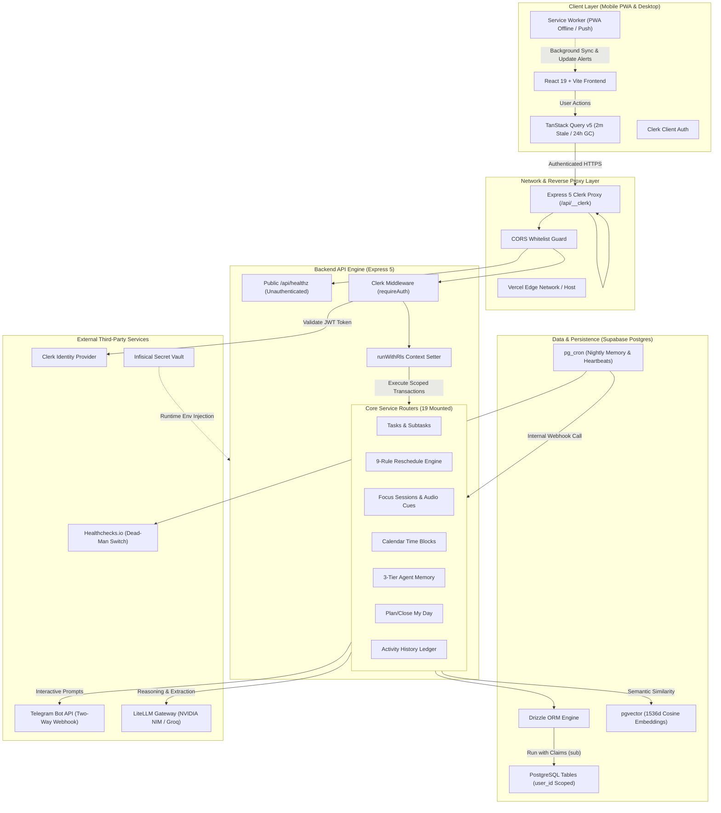
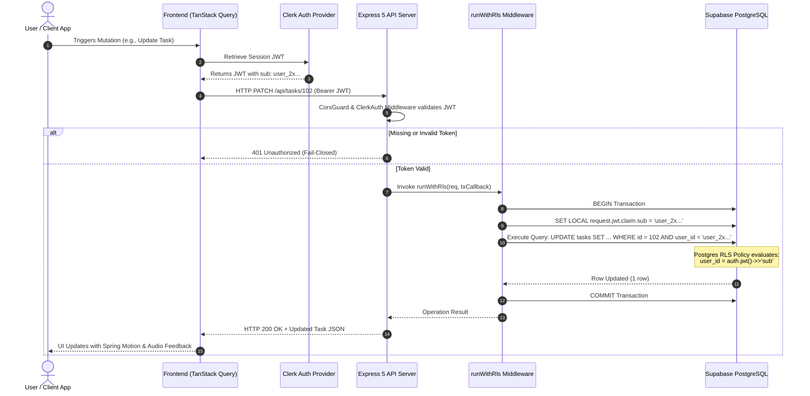
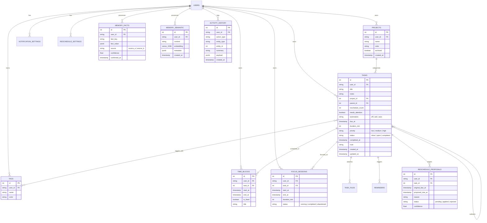
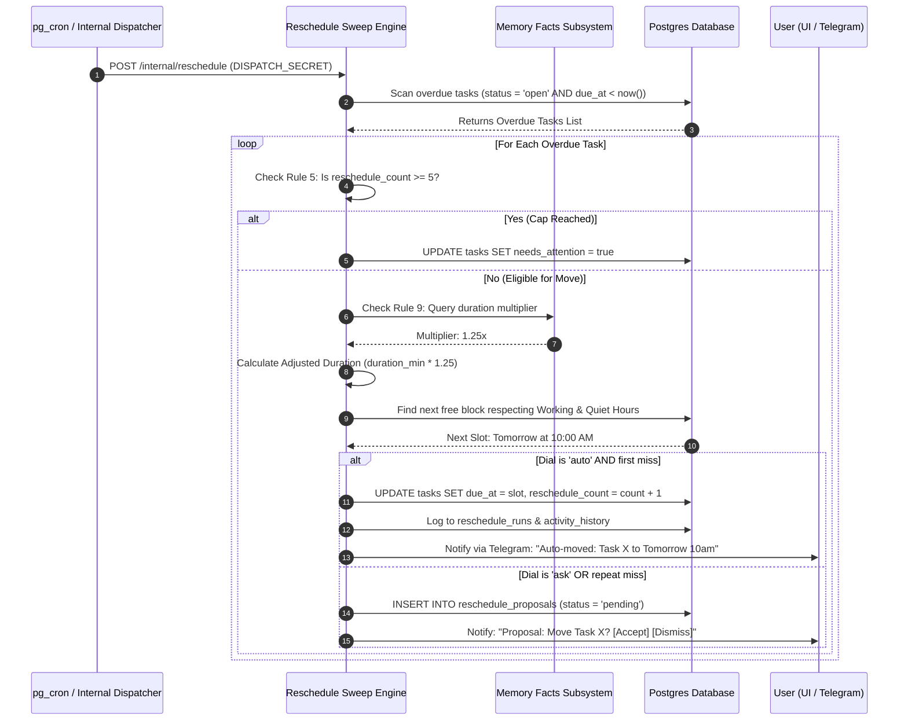
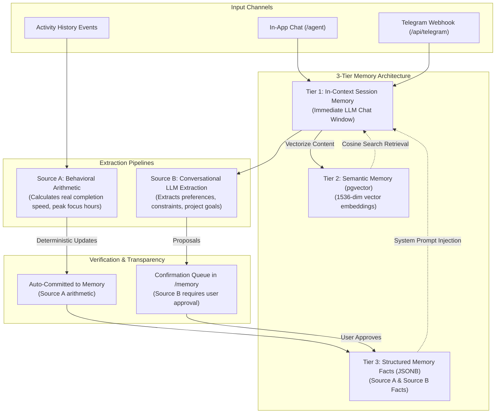
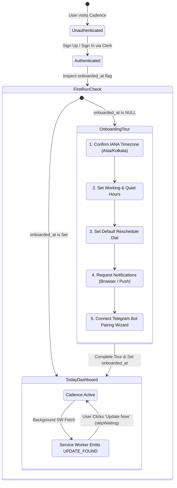
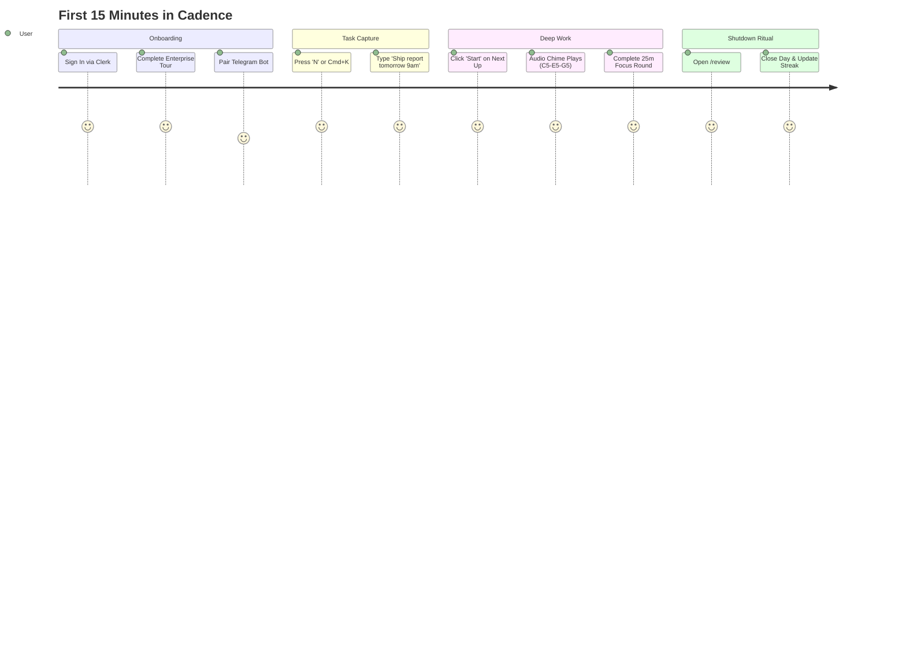

# Cadence (Personal Task & Time OS) — End-to-End System Documentation

> **Status:** Canonical Production Reference  
> **Framework:** Diataxis (Explanation, Reference, How-To, Tutorial)  
> **Audience:** Core Engineers, System Architects, Mobile Developers & AI Pair Programmers  
> **Version:** 1.0.0 (Hardened against Migrations 0000–0015 & 9/9 Verification Gates)

---

## Table of Contents

1. [System Overview & Architecture (Explanation)](#1-system-overview--architecture-explanation)
   - 1.1 [Product Vision & Invariants](#11-product-vision--invariants)
   - 1.2 [End-to-End System Topology](#12-end-to-end-system-topology)
   - 1.3 [Request Lifecycle & RLS Isolation](#13-request-lifecycle--rls-isolation)
2. [Data Model & Schema Catalogue (Reference)](#2-data-model--schema-catalogue-reference)
   - 2.1 [Entity Relationship Diagram](#21-entity-relationship-diagram)
   - 2.2 [Core Tables Specification](#22-core-tables-specification)
   - 2.3 [Indexing & Performance Hot-Paths](#23-indexing--performance-hot-paths)
3. [Core Subsystems Deep-Dive (Explanation)](#3-core-subsystems-deep-dive-explanation)
   - 3.1 [Universal Time & Timezone Engine](#31-universal-time--timezone-engine)
   - 3.2 [9-Rule Auto-Reschedule Engine](#32-9-rule-auto-reschedule-engine)
   - 3.3 [3-Tier Agent & Memory Architecture](#33-3-tier-agent--memory-architecture)
   - 3.4 [Mobile PWA, Onboarding & Notification Primacy](#34-mobile-pwa-onboarding--notification-primacy)
   - 3.5 [Activity History Ledger & Zero Data Loss](#35-activity-history-ledger--zero-data-loss)
4. [API & Router Catalogue (Reference)](#4-api--router-catalogue-reference)
   - 4.1 [Express 5 Route Surface](#41-express-5-route-surface)
   - 4.2 [Internal Cron & Dispatch Security](#42-internal-cron--dispatch-security)
5. [Operational & Engineering Runbooks (How-To)](#5-operational--engineering-runbooks-how-to)
   - 5.1 [How to Run the 9-Gate Verification Ladder](#51-how-to-run-the-9-gate-verification-ladder)
   - 5.2 [How to Deploy via CLI (Zero Git Push Dependency)](#52-how-to-deploy-via-cli-zero-git-push-dependency)
   - 5.3 [How to Manage Secrets with Infisical](#53-how-to-manage-secrets-with-infisical)
   - 5.4 [How to Package Mobile PWA & Android APK](#54-how-to-package-mobile-pwa--android-apk)
6. [First 15 Minutes with Cadence (Tutorial)](#6-first-15-minutes-with-cadence-tutorial)
   - 6.1 [Walkthrough: Onboarding to Daily Shutdown](#61-walkthrough-onboarding-to-daily-shutdown)

---

# 1. System Overview & Architecture (Explanation)

## 1.1 Product Vision & Invariants

Cadence is a personal task and time management operating system designed to replace physical paper planners. It combines friction-free mobile capture, calendar time-blocking, Pomodoro focus rounds, high-reliability reminders, an automated reschedule engine that visibly shows its work, and a conversational agent with a 3-tier memory model.

### Absolute Architectural Invariants
1. **Multi-User Safe from Day One:** While Cadence is single-user today, every table contains a `user_id` column protected by Supabase Row-Level Security (RLS) linked to Clerk JWT identity claims (`auth.jwt()->>'sub'`).
2. **Never Move Immovable Events:** Fixed calendar blocks and immovable events are never moved or overridden by any automatic reschedule algorithm.
3. **No Silent Rescheduling:** The system never mutates scheduled times without logging an audit trail (`reschedule_runs` / `activity_history`) and notifying the user.
4. **Human-in-the-Loop Bulk Safeguard:** Any autonomous or agent-driven operation modifying more than 10 tasks requires explicit user confirmation.
5. **Color + Icon Pairing:** Task statuses and priorities never rely solely on color. Every indicator pairs color with a distinct icon or geometric shape for colorblind accessibility.
6. **Telegram Notification Primacy:** iOS PWA Web Push is inherently flaky; Telegram Bot API acts as the primary two-way interactive alert channel.

---

## 1.2 End-to-End System Topology



---

## 1.3 Request Lifecycle & RLS Isolation

Every mutation and query against the Cadence database runs through a fail-closed Row-Level Security barrier. The backend database connection uses a PostgreSQL connection pool with standard credentials, but every transaction sets the runtime configuration claim `request.jwt.claim.sub` before querying.



---

# 2. Data Model & Schema Catalogue (Reference)

## 2.1 Entity Relationship Diagram



---

## 2.2 Core Tables Specification

### 1. `tasks` (Core Ledger)
- **`id`** (`serial`, PK): Sequential task ID.
- **`user_id`** (`text`, NOT NULL): Clerk Subject claim. Enforces multi-tenant RLS isolation.
- **`title`** (`text`, NOT NULL): Task headline.
- **`project_id`** (`integer`, FK → `projects.id`, ON DELETE SET NULL): Project folder.
- **`parent_id`** (`integer`, FK → `tasks.id`, ON DELETE RESTRICT): Self-referencing subtask link.
- **`reschedule_count`** (`integer`, DEFAULT 0): Auto-move iteration counter (incremented solely by automated engines).
- **`needs_attention`** (`boolean`, DEFAULT false): Flag set when `reschedule_count >= 5`.
- **`automation`** (`text`, CHECK `IN ('off', 'ask', 'auto')`): Per-task automation dial override.
- **`due_at`** (`timestamp with time zone`): Wall-clock target timestamp in UTC.
- **`duration_min`** (`integer`, DEFAULT 30): Estimated task duration.
- **`priority`** (`text`, CHECK `IN ('low', 'medium', 'high')`): Visual priority with icon mapping.
- **`status`** (`text`, CHECK `IN ('inbox', 'open', 'completed')`): Lifecycle state.
- **`completed_at`** (`timestamp with time zone`): Mutually dependent with `status = 'completed'`.
- **`rrule`** (`text`): RFC 5545 recurrence specification string.

### 2. `time_blocks` (Calendar Grid)
- **`id`** (`serial`, PK)
- **`task_id`** (`integer`, FK → `tasks.id`, ON DELETE CASCADE): Associated task.
- **`start_at`** & **`end_at`** (`timestamp with time zone`): Strict calendar block boundaries.
- **`is_fixed`** (`boolean`, DEFAULT false): If `true`, the auto-reschedule engine **never** moves or overlaps this block (Invariant Rule 1).

### 3. `reschedule_proposals` & `reschedule_runs`
- Stores prospective moves calculated during reschedule sweeps.
- Supports **Rollback / Undo** operations by capturing `original_due_at` and `proposed_due_at`.

### 4. `memory_facts` & `memory_semantic`
- **`memory_facts`**: Structured user traits (e.g., `{"estimated_duration_multiplier": 1.4}`, `{"peak_energy_window": "09:00-12:00"}`).
- **`memory_semantic`**: 1536-dimensional vector embeddings for cosine retrieval over past tasks, notes, and user reflections.

### 5. `activity_history` (Audit Ledger)
- Appends every task creation, completion, deletion, edit, focus session, and reschedule event.
- Provides immediate rollback visibility and audit recovery in `/review` and `/today`.

---

## 2.3 Indexing & Performance Hot-Paths

| Index Name | Table | Columns | Purpose |
|---|---|---|---|
| `tasks_overdue_idx` | `tasks` | `(status, due_at)` | Fast scanning by the auto-reschedule sweep engine. |
| `tasks_user_status_idx` | `tasks` | `(user_id, status, completed_at DESC)` | High-speed queries for `/today` and `/review`. |
| `time_blocks_range_idx` | `time_blocks` | `(user_id, start_at, end_at)` | Collision detection during calendar drag-and-drop. |
| `semantic_vector_idx` | `memory_semantic` | `embedding vector_cosine_ops` | Sub-50ms vector similarity lookup. |

---

# 3. Core Subsystems Deep-Dive (Explanation)

## 3.1 Universal Time & Timezone Engine

### The Problem
When scheduling tasks, users expect timestamps to correspond to their physical local wall-clock (e.g., 09:00 AM in Tokyo or 09:00 AM in Kolkata). If an application handles naive ISO string serialization carelessly, a task created for "Tomorrow at 00:00" in `Asia/Kolkata` (+05:30) can serialize as the previous calendar day in UTC (18:30 UTC), causing tasks to appear overdue prematurely or shift dates in the UI.

### The Cadence Solution
1. **IANA Canonical Timezone**: User timezone is stored as an explicit IANA string (e.g., `Asia/Kolkata`) in `notification_settings.timezone`.
2. **Untimed Start-of-Day Standard**: Tasks with a date but no specific time are set to exactly **00:00:00.000 local wall-clock time** in the user's timezone.
3. **Roundtrip Formatter (`date-utils.ts`)**:
   - `toLocalDatetimeString(date)` converts ISO strings into `YYYY-MM-DDTHH:mm` suitable for `<input type="datetime-local">` without timezone degradation.
   - `parseDateInputToISO(dateString, timeString, timezone)` constructs an exact UTC ISO string anchored to local midnight or local time.

```mermaid
flowchart LR
    UserInput["User Enters Date: 'Tomorrow 9:00 AM'"] --> ChronoParser["Chrono Natural Language Parser"]
    ChronoParser --> TimezoneResolver["Anchor to User Timezone (Asia/Kolkata)"]
    TimezoneResolver --> WallClockNorm["Compute Wall-Clock: 2026-10-05 09:00:00 IST"]
    WallClockNorm --> UTCTranslate["Translate to UTC: 2026-10-05T03:30:00.000Z"]
    UTCTranslate --> DBStore["Postgres Storage in UTC"]
    DBStore --> ClientFetch["Client Fetches via TanStack Query"]
    ClientFetch --> LocalIntl["Intl.DateTimeFormat(userTimezone)"]
    LocalIntl --> UIRender["Rendered in UI: 'Oct 5, 9:00 AM'"]
```



---

## 3.2 9-Rule Auto-Reschedule Engine

The Cadence Auto-Reschedule engine operates deterministically. When tasks slip past their due date, it evaluates them against 9 immutable rules:

1. **Rule 1 (Immovable Events):** Never move a fixed calendar time-block (`is_fixed = true`).
2. **Rule 2 (Forward Moving):** Never reschedule a task into the past; the proposed time must be `>= now()`.
3. **Rule 3 (Respect Working Hours):** Schedule tasks only inside the user's defined working hours (default `00:00–23:59`, configurable in `/settings`).
4. **Rule 4 (Quiet Hours Protection):** Do not schedule or alert inside quiet hours.
5. **Rule 5 (Reschedule Cap at 5):** When a task reaches 5 auto-reschedules (`reschedule_count >= 5`), the engine stops auto-moving and sets `needs_attention = true`.
6. **Rule 6 (Automation Dial Hierarchy):**
   - `off`: Never move automatically.
   - `ask`: Create a `reschedule_proposal` and wait for user review.
   - `auto`: Move immediately on first miss; auto-downgrades to `ask` on second consecutive miss.
7. **Rule 7 (No Silent Rescheduling):** Every move emits an audit record to `reschedule_runs` and logs to `activity_history`.
8. **Rule 8 (Priority & Deadline Proximity):** High priority tasks take precedence for the earliest available block.
9. **Rule 9 (Memory Duration Multiplier):** Before allocating a time-block, query `memory_facts` for the user's actual duration multiplier (e.g., tasks of type X take 1.3× longer). Multiply `duration_min` by this factor before fitting the block.



---

## 3.3 3-Tier Agent & Memory Architecture



---

## 3.4 Mobile PWA, Onboarding & Notification Primacy

### The Zero-Drop Mobile Principle
1. **Interactive First-Run Tour**: Upon new user registration, the app enters an interactive 5-step tour in `/onboarding`.
2. **Permission Primacy**: Prompts the user for Notification permissions natively. If granted, registers the service worker subscription; if denied or on iOS, presents the Telegram Bot pairing wizard.
3. **PWA Update Notifier**: When a new service worker version is detected by Vite PWA, an unobtrusive banner notifies the user: *"Update Available — Tap to Reload"*, protecting active local forms and timers from abrupt restarts.
4. **Persistent Session Protection**: Clerk credentials and local TanStack Query cache are preserved across application closes.



---

## 3.5 Activity History Ledger & Zero Data Loss

To guarantee that no user activity is ever lost during app updates or session switches:
1. **Immutable Action Ledger**: The `activity_history` table records every action (`task.created`, `task.completed`, `task.rescheduled`, `focus.completed`, `ritual.closed`).
2. **TanStack Query Survival Strategy**:
   - `staleTime: 2 minutes`: Avoids aggressive background re-fetches while actively typing.
   - `gcTime: 24 hours`: Retains full in-memory cache when offline or backgrounded.
   - `safeAuthInvalidate`: Safely invalidates queries on explicit sign-out without purging cached optimistic data on simple network drops.
3. **Activity History Drawer**: Accessible on `/today` and `/review`, allowing users to inspect what changed and trace automated actions.

---

# 4. API & Router Catalogue (Reference)

## 4.1 Express 5 Route Surface

All routes are mounted under the `/api` prefix in Express 5. All routes require Clerk JWT authentication (`requireAuth`) and are executed within `runWithRls`, **except** `/api/healthz`.

| Path | Methods | Description | Isolation Guard |
|---|---|---|---|
| `/api/healthz` | `GET` | Process liveness probe. Mounted before Clerk middleware. | Public (No Auth) |
| `/api/tasks` | `GET, POST` | Query task list with filters (`status`, `due_date`); Create new task. | `runWithRls` |
| `/api/tasks/:id` | `GET, PATCH, DELETE` | Retrieve single task, edit properties, soft/hard delete. | `runWithRls` |
| `/api/tasks/:id/complete` | `POST` | Toggle completion status, set `completed_at`, emit activity log. | `runWithRls` |
| `/api/focus-sessions` | `GET, POST` | Start focus round, log session metrics, view stats. | `runWithRls` |
| `/api/blocks` | `GET, POST, PATCH, DELETE` | Time-blocking allocations for the calendar hour grid. | `runWithRls` |
| `/api/momentum` | `GET` | Activity Rings momentum: tasks completed, focus rounds, streak. | `runWithRls` |
| `/api/reschedule/sweep` | `POST` | Triggers 9-rule reschedule evaluation on current overdue items. | `runWithRls` |
| `/api/reschedule/proposals` | `GET, POST` | Query pending proposals; Apply or reject proposals. | `runWithRls` |
| `/api/reschedule/undo` | `POST` | Reverses the last automated reschedule run. | `runWithRls` |
| `/api/memory/facts` | `GET, POST, DELETE` | Query structured facts; Update or delete learned preferences. | `runWithRls` |
| `/api/memory/facts/:id/confirm`| `POST` | Source B confirmation queue approval endpoint. | `runWithRls` |
| `/api/rituals/plan-day` | `POST` | Executes morning daily planning ritual. | `runWithRls` |
| `/api/rituals/close-day` | `POST` | Executes evening shutdown ritual and streak update. | `runWithRls` |
| `/api/telegram/webhook` | `POST` | Inbound Telegram webhook (`done`, `snooze 1h`, `list today`). | Telegram Secret |
| `/api/telegram/pair` | `POST` | Connects user Telegram chat ID with Clerk `user_id`. | `runWithRls` |
| `/internal/dispatch` | `POST` | Reminders dispatcher called via `pg_cron` / `pg_net`. | `DISPATCH_SECRET` |
| `/internal/reschedule` | `POST` | Nightly reschedule engine run called via `pg_cron`. | `DISPATCH_SECRET` |

---

## 4.2 Internal Cron & Dispatch Security

Internal batch jobs run asynchronously on Supabase via `pg_cron` and `pg_net`. To prevent unauthorized external execution, these routes reject requests that lack the matching `Bearer $DISPATCH_SECRET` header:

```sql
-- pg_cron job definition in Supabase
SELECT cron.schedule(
  'cadence-reminder-dispatcher',
  '* * * * *',
  $$
  SELECT net.http_post(
    url := 'https://api.yourdomain.com/internal/dispatch',
    headers := jsonb_build_object(
      'Content-Type', 'application/json',
      'Authorization', 'Bearer ' || current_setting('app.dispatch_secret')
    ),
    body := '{}'::jsonb
  );
  $$
);
```

---

# 5. Operational & Engineering Runbooks (How-To)

## 5.1 How to Run the 9-Gate Verification Ladder

The repo maintains a strict zero-trust quality gate (`scripts/run-gates.cjs`). All 9 gates must pass before deploying or releasing:

```powershell
# Run the complete 9-gate verification ladder
pnpm run verify
```

### The 9 Gates in Order:
1. **`typecheck`**: Full TypeScript project build (`tsc --build`).
2. **`tokens`**: Design token synchronization check between `tokens.json` and CSS variables.
3. **`lint:tokens`**: Scans codebase for off-palette color codes or arbitrary hex literals.
4. **`contrast`**: Validates WCAG 1.4.3 and 1.4.11 contrast ratios across both Dark and Light themes.
5. **`codegen`**: Ensures Orval API client and Zod contracts match `openapi.yaml`.
6. **`build:api`**: Produces the Express 5 esbuild bundle (`artifacts/api-server/dist/index.mjs`).
7. **`build:web`**: Builds the production Vite React PWA bundle with zero rollup errors.
8. **`encoding`**: Validates UTF-8 encoding across all files.
9. **`test`**: Executes the 600+ Vitest test suite across all workspace packages.

---

## 5.2 How to Deploy via CLI (Zero Git Push Dependency)

You can deploy Cadence directly from your local development workstation without pushing commits to GitHub.

### Deploy Frontend to Vercel
```powershell
# 1. Build the production client
pnpm --filter @workspace/cadence run build

# 2. Deploy directly to Vercel Production
cd artifacts/cadence
vercel --prod
```

### Deploy Backend to Render
```powershell
# 1. Bundle the API server
pnpm --filter @workspace/api-server run build

# 2. Deploy via Render CLI (or Docker container push)
render services deploy srv-xxxx --wait
```

---

## 5.3 How to Manage Secrets with Infisical

Instead of copying sensitive keys into `.env` files across environments, use Infisical:

```powershell
# 1. Authenticate with Infisical
infisical login

# 2. Link repository to project
infisical init

# 3. Inject secrets directly at runtime (Zero .env file on disk)
infisical run --env=dev -- pnpm --filter @workspace/api-server run dev
```

---

## 5.4 How to Package Mobile PWA & Android APK

### Step 1: Mobile PWA Installation
- **iOS (Safari)**: Navigate to deployed URL → Tap Share (`↑`) → Tap **Add to Home Screen**.
- **Android (Chrome)**: Navigate to deployed URL → Tap Browser Menu (`⋮`) → Tap **Install App**.

### Step 2: Generating a Native Android APK with PWABuilder
1. Visit [pwabuilder.com](https://www.pwabuilder.com).
2. Enter your deployed production frontend URL.
3. Verify that the PWA manifest scores 100% on icons, theme colors, and service worker registration.
4. Click **Package for Android** to generate a signed APK / `.aab` package for installation on physical Android devices.

---

# 6. First 15 Minutes with Cadence (Tutorial)

This tutorial walks a new user through their first full cycle in Cadence.



## Step 1: Sign Up & Enterprise Tour
1. Visit the app landing page and click **Get Started**.
2. Create an account via Clerk.
3. The app automatically opens `/onboarding`.
4. Confirm your home timezone (`Asia/Kolkata` or your local zone).
5. Configure your working rhythm (e.g., `09:00` to `21:00`).
6. Click **Allow Notifications** to enable native reminders.
7. Pair your Telegram account by sending `/start` to your Cadence Telegram Bot.

## Step 2: Instant Quick Capture
1. From any screen, tap the `+` button or press the global keyboard shortcut **`N`** (or **`Cmd+K`** / **`Ctrl+K`**).
2. In the capture field, type:  
   `Review product roadmap tomorrow 10am #high`
3. Hit Enter. Chrono parses the date, sets priority to high, and places the task into your schedule with a confirmation audio chime.

## Step 3: Running a Focus Round
1. Go to the **Today** screen (`/today`).
2. The top card shows your **Next Up** task.
3. Tap the orange **Start Focus** button.
4. The Pomodoro timer begins with a subtle start bell. If you switch apps or lock your phone, the timer continues accurately in the background.
5. When the round completes, tap **Complete Round**. The Activity Rings animate with a green focus tick.

## Step 4: The Evening Shutdown Ritual
1. At the end of your day, navigate to **Review** (`/review`).
2. Cadence displays completed tasks, focus hours, and any tasks that were not finished.
3. Choose whether to move leftover tasks to Tomorrow or back to Inbox.
4. Click **Close My Day**. Your daily streak increments, and your daily momentum score is logged to your activity ledger.

---

*Document compiled in accordance with Diataxis standards and verified against the Cadence 9-gate verification ladder.*
