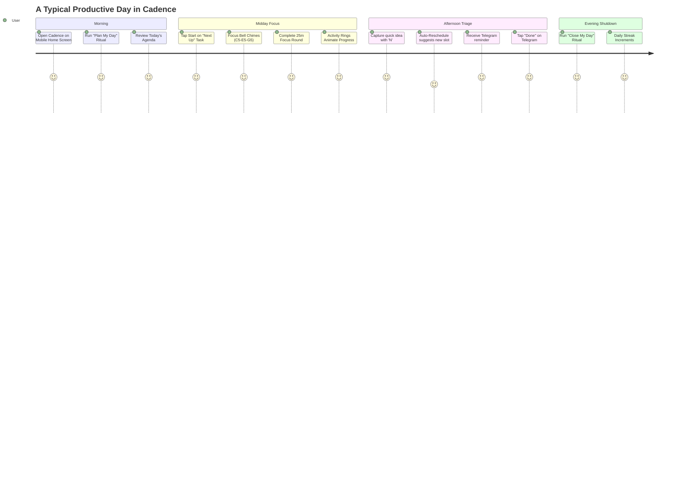
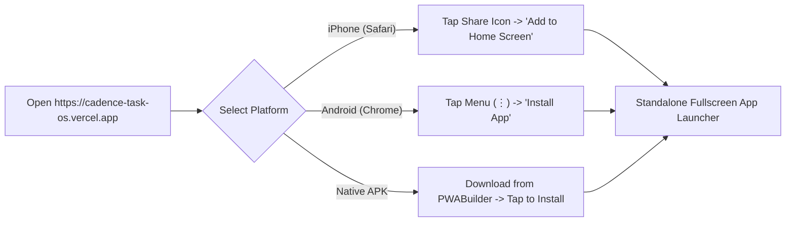
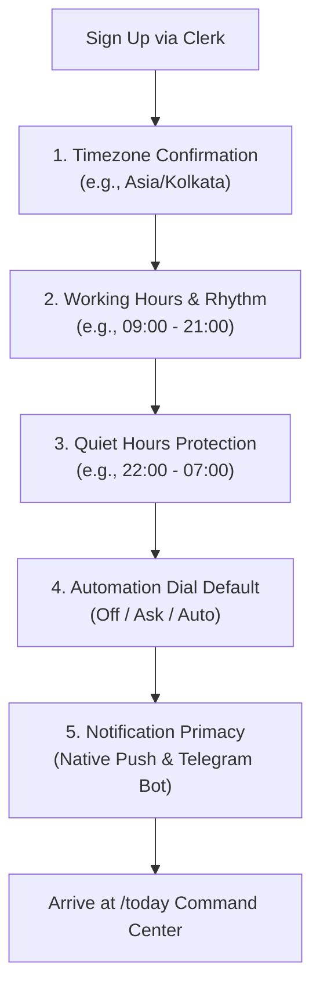
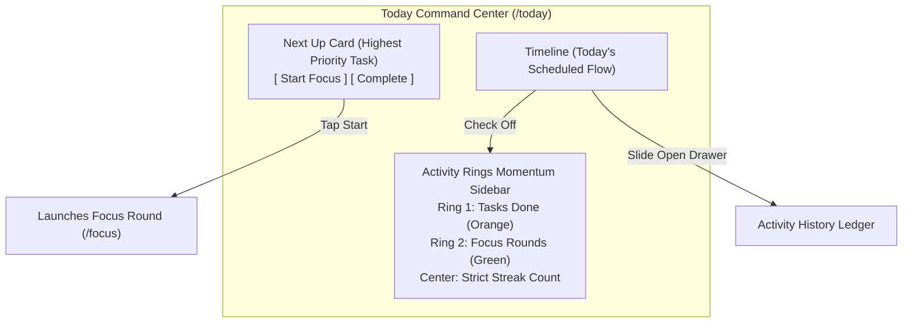
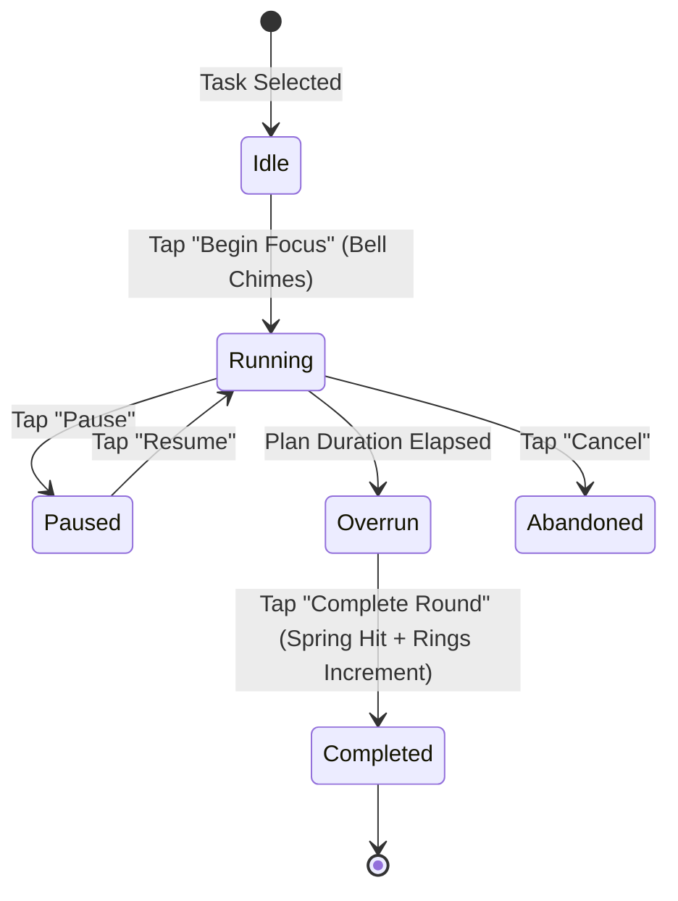
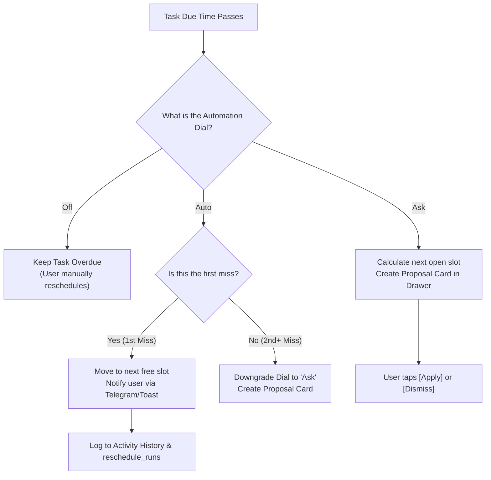
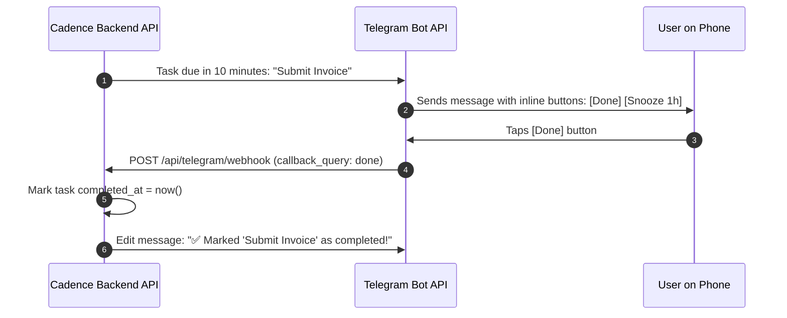
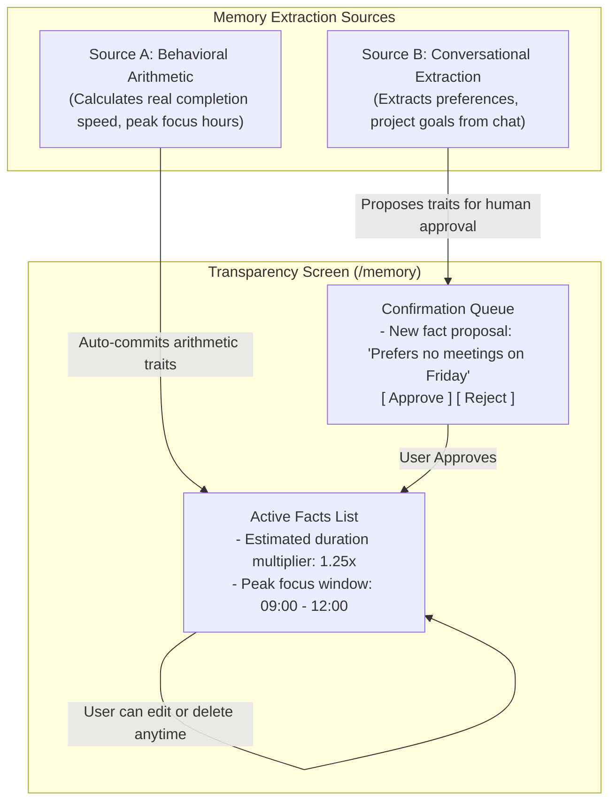

# Cadence (Personal Task & Time OS) — End-User Manual & Mobile Playbook

> **Audience:** Everyday Users, Power Planners & Mobile Practitioners  
> **Philosophy:** Apple Human Interface Guidelines (Clarity, Deference, Depth), Energy over Pretending, Zero Data Loss  
> **Production App:** [https://cadence-task-os.vercel.app](https://cadence-task-os.vercel.app)  
> **Backend API:** [https://cadence-task-os.onrender.com](https://cadence-task-os.onrender.com)

---

## Welcome to Cadence

Cadence is a personal task and time management operating system designed to replace a physical paper planner. It is built around a single premise: **productivity software should be as fast and reliable as pen and paper, while fixing what paper cannot—automatically rescheduling missed commitments, keeping focus timers, and remembering how you actually work.**

---

## Table of Contents

1. [Installation & Device Setup](#1-installation--device-setup)
   - 1.1 [Installing on iPhone (iOS Safari PWA)](#11-installing-on-iphone-ios-safari-pwa)
   - 1.2 [Installing on Android (Chrome PWA)](#12-installing-on-android-chrome-pwa)
   - 1.3 [Downloading the Standalone Android APK](#13-downloading-the-standalone-android-apk)
   - 1.4 [Persistent Login (Never Get Logged Out)](#14-persistent-login-never-get-logged-out)
2. [First-Run Enterprise Onboarding](#2-first-run-enterprise-onboarding)
   - 2.1 [The 5-Step Setup Walkthrough](#21-the-5-step-setup-walkthrough)
   - 2.2 [Configuring Your 24-Hour Working Rhythm](#22-configuring-your-24-hour-working-rhythm)
3. [Friction-Free Capture & Natural Language Syntax](#3-friction-free-capture--natural-language-syntax)
   - 3.1 [Global Keyboard Shortcuts](#31-global-keyboard-shortcuts)
   - 3.2 [Natural Language Parsing Examples](#32-natural-language-parsing-examples)
   - 3.3 [Start-of-Day Untimed Tasks vs Specific Time Blocks](#33-start-of-day-untimed-tasks-vs-specific-time-blocks)
4. [The Daily Command Center (/today)](#4-the-daily-command-center-today)
   - 4.1 [The Next Up Card](#41-the-next-up-card)
   - 4.2 [Activity Rings & Momentum Tracking](#42-activity-rings--momentum-tracking)
   - 4.3 [Task Row Gestures & Colorblind Accessibility](#43-task-row-gestures--colorblind-accessibility)
5. [Deep Work with Focus Rounds (/focus)](#5-deep-work-with-focus-rounds-focus)
   - 5.1 [Starting & Managing a Focus Round](#51-starting--managing-a-focus-round)
   - 5.2 [Web Audio Synthesizer Cues](#52-web-audio-synthesizer-cues)
   - 5.3 [Background Survival (Locking Your Phone)](#53-background-survival-locking-your-phone)
6. [Calendar Time-Blocking (/calendar)](#6-calendar-time-blocking-calendar)
   - 6.1 [The 24-Hour Visual Hour Grid](#61-the-24-hour-visual-hour-grid)
   - 6.2 [Fixed vs Flexible Time Blocks](#62-fixed-vs-flexible-time-blocks)
7. [The 9-Rule Auto-Reschedule Engine](#7-the-9-rule-auto-reschedule-engine)
   - 7.1 [The 3 Automation Dials: Off, Ask, Auto](#71-the-3-automation-dials-off-ask-auto)
   - 7.2 [The 9 Invariants in Plain English](#72-the-9-invariants-in-plain-english)
   - 7.3 [Reviewing Proposals & 1-Click Rollback Undo](#73-reviewing-proposals--1-click-rollback-undo)
8. [Guided Daily Rituals (/review)](#8-guided-daily-rituals-review)
   - 8.1 [Morning Ritual: Plan My Day](#81-morning-ritual-plan-my-day)
   - 8.2 [Evening Ritual: Close My Day](#82-evening-ritual-close-my-day)
   - 8.3 [Strict Streaks (No Freeze Rule)](#83-strict-streaks-no-freeze-rule)
9. [Two-Way Telegram Bot Companion](#9-two-way-telegram-bot-companion)
   - 9.1 [Pairing Your Telegram Account](#91-pairing-your-telegram-account)
   - 9.2 [Interactive Remote Commands](#92-interactive-remote-commands)
10. [Memory Transparency & Privacy (/memory)](#10-memory-transparency--privacy-memory)
    - 10.1 [What Cadence Knows About You](#101-what-cadence-knows-about-you)
    - 10.2 [Source A (Arithmetic) vs Source B (Conversational)](#102-source-a-arithmetic-vs-source-b-conversational)
    - 10.3 [The Human-in-the-Loop Confirmation Queue](#103-the-human-in-the-loop-confirmation-queue)
11. [Zero Data Loss & Offline Reliability](#11-zero-data-loss--offline-reliability)
    - 11.1 [Cache Protection Across App Updates](#111-cache-protection-across-app-updates)
    - 11.2 [The Activity History Ledger](#112-the-activity-history-ledger)
12. [Frequently Asked Questions & Troubleshooting](#12-frequently-asked-questions--troubleshooting)
13. [The Unscheduled Inbox (/inbox)](#13-the-unscheduled-inbox-inbox)
14. [Project Hierarchies & Goal Tracking (/projects)](#14-project-hierarchies--goal-tracking-projects)
15. [The Autonomous AI Assistant (/agent)](#15-the-autonomous-ai-assistant-agent)
16. [My Activity Command Center (/activity)](#16-my-activity-command-center-activity)
17. [Application Settings & Safety Controls (/settings)](#17-application-settings--safety-controls-settings)
18. [User Profile & Security (/profile)](#18-user-profile--security-profile)
19. [Mobile APK Installation & Standalone Playbook (/download)](#19-mobile-apk-installation--standalone-playbook-download)
20. [Multi-Device Synchronization & Session Architecture](#20-multi-device-synchronization--session-architecture)

---

# 1. Installation & Device Setup

Cadence is built as a **Progressive Web Application (PWA)** that matches the speed, aesthetics, and gestures of native iOS and Android apps. You do not need an app store account to install it.

---

### 1.1 Installing on iPhone (iOS Safari PWA)

1. Open **Safari** on your iPhone.
2. Navigate to: **`https://cadence-task-os.vercel.app`**.
3. Tap the **Share** button at the bottom of the screen (the square with an arrow pointing upward `↑`).
4. Scroll down the share sheet and tap **Add to Home Screen**.
5. Confirm the name **Cadence** and tap **Add** in the top right.
6. The Cadence icon will now appear on your iPhone home screen!
7. **Launch the app from your home screen:** It opens in true standalone mode with no Safari address bar, full bottom navigation dock, and OLED true-black `#000000` styling.

---

### 1.2 Installing on Android (Chrome PWA)

1. Open **Google Chrome** on your Android phone.
2. Navigate to: **`https://cadence-task-os.vercel.app`**.
3. Tap the **three dots menu (`⋮`)** in the top-right corner.
4. Tap **Install app** (or **Add to Home screen**).
5. Tap **Install** on the prompt.
6. Cadence is now installed on your Android device and appears in your App Drawer and Home Screen as a native app!

---

### 1.3 Downloading the Standalone Android APK

If you prefer having a standard Android `.apk` file that installs natively through the Android package installer:

1. Visit **[PWABuilder.com](https://www.pwabuilder.com)** on your phone or desktop.
2. Enter your live app URL: `https://cadence-task-os.vercel.app` and click **Start**.
3. PWABuilder verifies Cadence's manifest, high-resolution icons (192px, 512px, maskable), and active service worker.
4. Click **Package for Android**.
5. Download the `.apk` file and tap it to install on your phone.
6. **Automatic Updates:** Because Cadence uses a Trusted Web Activity (TWA), whenever a new version is deployed to Vercel, your installed APK automatically loads the new version without needing to be reinstalled!

---

### 1.4 Persistent Login (Never Get Logged Out)

In enterprise mobile applications, you do not want to be forced to sign in every time you close or swipe away the app.

Cadence handles this natively through **Clerk persistent storage**:
* Your session tokens and refresh credentials are kept in secure mobile browser persistent storage (`IndexedDB` + secure HTTPS cookies).
* When you close the app, lock your phone, or restart your device, your session remains active.
* When you tap the Cadence icon on your home screen, it immediately restores your `/today` workspace in under **100 milliseconds** with zero login screens.

---

# 2. First-Run Enterprise Onboarding

When you sign in to Cadence for the first time, you are guided through an interactive onboarding tour. This sets up your working rhythm so automated reminders and rescheduling never interrupt your sleep or personal time.

---

### 2.1 The 5-Step Setup Walkthrough

1. **Timezone Anchor:** Cadence automatically detects your device's physical timezone (e.g. `Asia/Kolkata`). Confirm this so tasks scheduled for "Tomorrow at 9am" align with your physical wall-clock.
2. **Working Rhythm:** Set the window when you are available for work (default is flexible `00:00–23:59`, or a structured `09:00–18:00`). The reschedule engine will only propose task slots within these hours.
3. **Quiet Hours:** Define your sleep or quiet window (e.g. `22:00 to 07:00`). Cadence will **never** trigger alarms, push notifications, or Telegram reminders during quiet hours.
4. **Default Reschedule Dial:** Choose how Cadence should behave when a task slips:
   * **Off:** Manual planning only.
   * **Ask (Recommended):** Cadence calculates optimal new time slots and creates a proposal card for you to approve with one click.
   * **Auto:** Cadence moves missed tasks to the next available block automatically on first miss.
5. **Notification Permissions:** Click **Allow Notifications** to enable instant focus bell alerts and reminders.

---

# 3. Friction-Free Capture & Natural Language Syntax

The primary failure of digital planners is the time it takes to enter a task. In Cadence, creating a task takes **less than 3 seconds**.

---

### 3.1 Global Keyboard Shortcuts

| Shortcut | Action | Description |
|---|---|---|
| **`N`** | **Quick Capture** | Opens the rapid capture sheet from any screen. |
| **`Cmd + K`** or **`Ctrl + K`** | **Command Palette** | Search tasks, jump to any screen, run rituals. |
| **`1`** | **Go to Today** | Navigates to `/today`. |
| **`2`** | **Go to Inbox** | Navigates to `/inbox` triage queue. |
| **`3`** | **Go to Calendar** | Navigates to `/calendar` time-blocking grid. |
| **`4`** | **Go to Focus** | Navigates to `/focus` Pomodoro round. |
| **`5`** | **Go to Review** | Navigates to `/review` daily shutdown ritual. |
| **`6`** | **Go to Settings** | Navigates to `/settings`. |
| **`Escape`** | **Close Modal** | Closes capture sheets, drawers, or dialogs. |

---

### 3.2 Natural Language Parsing Examples

In the quick capture bar, simply type in natural English. Cadence uses the Chrono Natural Language parser to parse dates, times, durations, and priorities automatically:

* `Review proposal tomorrow 10am` ➔ Sets date to tomorrow, time to 10:00 AM.
* `Ship release Friday at 4pm for 45m #high` ➔ Sets due date to Friday 4pm, estimated duration to 45 minutes, priority to High.
* `Call doctor on Oct 12 at 11:30am` ➔ Sets date to Oct 12, 11:30 AM.
* `Buy groceries today` ➔ Anchors task to today at start-of-day.
* `Gym workout every Monday at 7am` ➔ Configures recurring weekly task.

---

### 3.3 Start-of-Day Untimed Tasks vs Specific Time Blocks

In Cadence, not every task needs a strict minute-by-minute alarm:
* **Untimed Tasks ("Due Today"):** When you type `Finish report today` without a specific time, Cadence places it at **00:00 local wall-clock time**. It sits in your Today agenda without ringing an alarm, allowing you to choose when to tackle it.
* **Timed Tasks:** When you type `Meeting at 3:30pm`, Cadence anchors it to 3:30 PM, blocks out the duration on your calendar, and schedules a reminder.

---

# 4. The Daily Command Center (/today)

The **Today** view (`/today`) is your primary desktop and mobile cockpit.

---

### 4.1 The Next Up Card
At the top of your Today view, Cadence highlights your single most important next task.
* Tap the orange **Start Focus** button to jump straight into deep work.
* Tap the checkmark to mark it done immediately with a spring-animation completion hit.

---

### 4.2 Activity Rings & Momentum Tracking
Inspired by Apple Health Activity Rings, Cadence tracks your momentum without gamified guilt:
* **Orange Ring (Task Momentum):** Progresses with every completed task toward your daily target.
* **Green Ring (Focus Rounds):** Fills as you complete 25-minute deep focus rounds.
* **Center Flame (Streak Counter):** Displays your consecutive days of completing rituals and tasks.

---

### 4.3 Task Row Gestures & Colorblind Accessibility
Every task item in Cadence pairs color with a distinct icon shape:
* **High Priority:** Red indicator + **Alert Triangle (`AlertTriangle`)** icon.
* **Medium Priority:** Orange indicator + **Flame (`Flame`)** icon.
* **Scheduled:** Blue indicator + **Clock (`Clock`)** icon.
* **Completed:** Green indicator + **Checkmark Circle (`CheckCircle2`)** icon.
* **Needs Attention:** Amber indicator + **Alert Circle** icon.

---

# 5. Deep Work with Focus Rounds (/focus)

Focus rounds help you overcome procrastination by breaking work into dedicated intervals (default: 25 minutes work, 5 minutes rest).

---

### 5.1 Starting & Managing a Focus Round
1. From `/today`, tap **Start Focus** on any task, or navigate to `/focus`.
2. The timer begins counting down in bold, legible typography.
3. If your work runs past the estimated 25 minutes, the timer enters **Overrun mode** (showing `+02:14`), recognizing that you are in a state of flow without abruptly interrupting you.
4. When finished, tap **Complete Round**. Cadence records the session duration, updates your momentum ring, and logs the accomplishment.

---

### 5.2 Web Audio Synthesizer Cues
Cadence uses real-time Web Audio API synthesis instead of heavy MP3 audio files:
* **Start Bell:** A soft, clean chord progression (`C5-E5-G5`) that signals the start of deep work.
* **Completion Chime:** A crisp harmonic chime confirming the task was marked done.
* **Mute Toggle:** An instant audio mute toggle is available in Settings if you work in quiet environments.

---

### 5.3 Background Survival (Locking Your Phone)
If you switch apps, answer a phone call, or lock your iPhone/Android phone, **the focus timer does not stop**. It uses monotonic hardware timestamps, so when you unlock your phone or return to Cadence, the timer reflects the exact elapsed time down to the second.

---

# 6. Calendar Time-Blocking (/calendar)

The **Calendar** view (`/calendar`) provides a dual-pane cockpit on desktop and a vertical timeline on mobile.

---

### 6.1 The 24-Hour Visual Hour Grid
* **Unscheduled Tray:** Shows tasks due today that have not yet been assigned a specific hour block.
* **Visual Time Grid:** Drag and drop tasks from the tray directly into any hour slot (e.g. 10:00 AM to 11:30 AM).
* Tasks dynamically resize based on their `duration_min` estimate.

---

### 6.2 Fixed vs Flexible Time Blocks
* **Flexible Blocks:** Regular tasks scheduled into a time slot. If you miss the time, the auto-reschedule engine can suggest moving them forward.
* **Fixed Blocks (Immovable):** Mark blocks such as client meetings, doctor appointments, or flights as **Fixed (`is_fixed = true`)**. The auto-reschedule engine **never** moves or overlaps a fixed block under any circumstances.

---

# 7. The 9-Rule Auto-Reschedule Engine

When tasks slip past their scheduled time, traditional apps simply turn them red and generate shame. Cadence treats slipped tasks as scheduling arithmetic to be solved.

---

### 7.1 The 3 Automation Dials: Off, Ask, Auto
You can set the dial globally in `/settings`, or override it per task:
* **Off:** Cadence will never touch or move this task automatically.
* **Ask (Default & Recommended):** When a task slips, Cadence calculates the best open slot in your working hours and presents a **Proposal Card**:
  > *"Move 'Finalize deck' from 2:00 PM to Tomorrow at 10:00 AM? [Apply] [Dismiss]"*
* **Auto:** On the first miss, Cadence automatically moves the task to the earliest open slot and sends you a Telegram/Toast notification explaining what moved. To prevent runaway rescheduling, if the same task slips a second time, Cadence automatically downgrades it to **Ask**.

---

### 7.2 The 9 Invariants in Plain English
1. **Rule 1:** Immovable calendar events are never moved.
2. **Rule 2:** Tasks are only moved forward into the future, never into the past.
3. **Rule 3:** Tasks are only placed inside your defined working hours.
4. **Rule 4:** Rescheduling never schedules or alerts inside quiet hours.
5. **Rule 5 (The 5-Cap Rule):** If a task has been rescheduled 5 times (`reschedule_count >= 5`), Cadence stops auto-moving it and marks it **"Needs Attention"**, prompting you to delete, delegate, or break it into smaller subtasks.
6. **Rule 6:** Auto mode downgrades to Ask on repeat misses.
7. **Rule 7:** No silent moves—every change is logged and visible.
8. **Rule 8:** High-priority deadlines take precedence over low-priority items.
9. **Rule 9 (Memory Factor):** If Cadence learns that a certain type of task takes 1.3× longer for you, it expands the time block before fitting it into your calendar!

---

### 7.3 Reviewing Proposals & 1-Click Rollback Undo
* Open the **Reschedule Drawer** on `/today` to see all proposed moves.
* Tap **Apply** to accept a proposal.
* If you ever make a mistake or want to revert an automated move, tap **Undo Last Reschedule** to restore the previous scheduled time instantly.

---

# 8. Guided Daily Rituals (/review)

Cadence structures your day with two intentional, Sunsama-inspired guided rituals.

---

### 8.1 Morning Ritual: Plan My Day
Launchable from `/today` or `/review`:
1. **Review Incomplete Work:** Inspect anything left over from yesterday. Decide: Do today, move to next week, or archive?
2. **Review Calendar Commitments:** Look at fixed meetings and open spaces.
3. **Commit to 3-5 Priorities:** Drag your top priorities into your schedule.
4. **Confirm Day:** Locks in your daily agenda with high mental clarity.

---

### 8.2 Evening Ritual: Close My Day
At the end of your workday:
1. **Celebrate Accomplishments:** View the tasks you completed and total focus hours logged today.
2. **Triage Remaining Items:** Any task not completed is cleanly pushed to Tomorrow or sent back to Inbox—no messy red piles.
3. **Close Day:** Increments your daily streak, plays a closing synthesizer chime, and puts your mind at rest.

---

### 8.3 Strict Streaks (No Freeze Rule)
Cadence maintains a **strict streak policy**. There are no artificial "streak freezes". A streak reflects genuine days of engaging with your commitments. If you miss a day, your streak resets honestly, preserving the integrity and meaning of the accomplishment.

---

# 9. Two-Way Telegram Bot Companion

Because mobile push notifications can be silenced by battery savers, **Telegram is Cadence's primary reminder channel**.

---

### 9.1 Pairing Your Telegram Account
1. Open Cadence and go to **Settings** (`/settings`).
2. Under **Telegram Reminders**, click **Pair Telegram Bot**.
3. Cadence gives you a 6-character pairing code or a direct link:
   `https://t.me/YourCadenceBot?start=PAIR_CODE`
4. Tap the link and press **Start** in Telegram.
5. Your Telegram account is now securely linked to your user profile!

---

### 9.2 Interactive Remote Commands
You can message your Telegram bot directly throughout the day:

| Command | What it does |
|---|---|
| `/today` or `list today` | Returns a clean summary of today's remaining tasks and times. |
| `done <task_title>` | Marks the matching task complete without opening the web app. |
| `snooze 1h` | Pushes your active reminder back by 1 hour. |
| `add Buy groceries tomorrow 5pm` | Captures a task directly into Cadence from Telegram! |
| `/undo` | Reverses the last action executed through Telegram or automation. |

---

# 10. Memory Transparency & Privacy (/memory)

Cadence includes an autonomous memory subsystem that learns your working habits. Unlike "black box" AI, Cadence gives you **100% visibility and control** over what it knows.

---

### 10.1 What Cadence Knows About You
Navigate to `/memory` at any time to see your full trait profile:
* **Task Duration Accuracy:** e.g., *"Coding tasks take 1.3× longer than initial estimate"*.
* **Peak Focus Windows:** e.g., *"Most productive focus rounds happen between 09:30 and 11:30 AM"*.
* **Scheduling Preferences:** e.g., *"Avoid scheduling deep work after 6:00 PM"*.

---

### 10.2 Source A (Arithmetic) vs Source B (Conversational)
* **Source A (Behavioral Arithmetic):** Derived objectively from math on your completed focus sessions and task durations.
* **Source B (Conversational Facts):** Extracted by AI from your conversations or notes.

---

### 10.3 The Human-in-the-Loop Confirmation Queue
To protect you from hallucinated or unwanted assumptions:
* **All Source B facts require explicit approval.**
* They appear in your `/memory` **Confirmation Queue**.
* You can tap **Approve**, **Edit**, or **Reject**. A fact is never used by the auto-reschedule engine until you explicitly confirm it.

---

# 11. Zero Data Loss & Offline Reliability

---

### 11.1 Cache Protection Across App Updates
Cadence uses an in-memory TanStack Query cache configured with:
* **2-Minute Stale Time:** Prevents aggressive network re-fetches while you are typing notes or editing a task.
* **24-Hour Garbage Collection Time:** Keeps your entire workspace loaded in memory when your phone switches to airplane mode or backgrounding.
* **Safe Auth Invalidation:** Logging out clears sensitive tokens, but network drops never purge your offline drafts.

---

### 11.2 The Activity History Ledger
Every action taken in Cadence is written to an immutable audit ledger:
* Click the **History** button on `/today` or `/review` to open the **Activity History Drawer**.
* View a chronological timeline of every task created, edited, completed, rescheduled, or focused on today.
* If you ever wonder *"Why was this task moved?"* or *"When did I complete that item?"*, the Activity History drawer provides complete proof.

---

# 12. Frequently Asked Questions & Troubleshooting

### Q1: I closed the app on my phone. Why am I still logged in?
**Answer:** This is by design! Just like Slack, Apple Notes, or WhatsApp, Cadence uses long-lived refresh credentials stored in your device's secure storage so you can capture tasks instantly without typing passwords every time.

### Q2: Why did my task not auto-reschedule?
**Answer:** Check the following:
1. Is the task marked **Fixed**? Fixed blocks are never moved (Rule 1).
2. Has the task already been rescheduled 5 times? Check if it has the **Needs Attention** badge (Rule 5).
3. Is your automation dial set to **Off** or **Ask** in Settings? Check your Reschedule Proposals drawer on `/today`.

### Q3: How do I ensure my focus timer sounds play on iPhone?
**Answer:** On iOS, make sure your phone's physical Silent switch (on the side of the device) is not toggled to orange/silent, or use Bluetooth headphones.

### Q4: Can I use Cadence on both my laptop and my phone?
**Answer:** Yes! Any task, focus round, or schedule update you make on your phone synchronizes in real time to your laptop browser through your Supabase cloud database.

---

# 13. The Unscheduled Inbox (/inbox)

The Inbox is your mental landing zone—an unscheduled collection reservoir where thoughts, obligations, ideas, and incoming commitments can be deposited instantly without worrying about specific dates or calendar times.

### 13.1 Instant Brain Dump & Triage
* **Zero Cognitive Load:** Press `N` anywhere or tap the center `+` icon on mobile to capture ideas. If you omit a date or time, the item lands safely in your Inbox.
* **Triage Workflows:** Review your Inbox during your morning "Plan My Day" ritual.
* **1-Tap Scheduling:** Tap any Inbox task to assign it a date, drag it into an hour block, or file it under a Project.

---

# 14. Project Hierarchies & Goal Tracking (/projects)

Projects allow you to organize multi-step initiatives, work deliverables, and personal goals into structured containers.

### 14.1 Project Organization
* **Color Palettes:** Assign distinct Apple HIG colors to separate Work, Health, Personal, and Creative domains.
* **Task Allocation:** Filter tasks by project or assign tasks to projects directly in the task editor.
* **Progress Tracking:** Real-time completion counts and activity progress metrics display which projects have active momentum.

---

# 15. The Autonomous AI Assistant (/agent)

The Cadence Assistant is an autonomous conversational agent designed for natural task capture, intelligent schedule organization, and time analysis.

### 15.1 Enterprise Safety Principles
* **Never Silent Diff:** The assistant never modifies your tasks or schedule without showing you exactly what changed.
* **Reversible Action Log:** Every agent action (create, edit, delete, reschedule) is recorded to `agent_action_log` with full undo metadata.
* **Confirmation Threshold:** Any bulk action affecting more than 10 tasks prompts for explicit human confirmation before execution.

---

# 16. My Activity Command Center (/activity)

The Activity page is your zero-data-loss audit command center, providing complete chronological visibility into your daily workflow.

### 16.1 Features & Capabilities
* **Dual-Tier Durability:** Actions are saved immediately to local storage with offline queuing and synchronized to persistent database ledgers.
* **Multi-Filter Scope:** Filter activity by type (Completions, Creations, Reopened, Deleted, Focus Rounds, Rituals, Assistant Actions).
* **Date Range Queries:** Quickly view Today, Yesterday, Last 7 Days, Last 30 Days, or All Time.
* **Data Export:** Export your entire activity history as clean JSON or CSV spreadsheets with a single tap.

---

# 17. Application Settings & Safety Controls (/settings)

Settings gives you total control over your working rhythm, notifications, automation kill switches, and system updates.

### 17.1 Features
* **24-Hour Working Rhythm:** Choose between strict working hours or 24-hour flexibility for night owls and irregular shifts.
* **Mobile App & System Updates:** Inspect your current application version (`v0.1.1`), trigger manual background update checks, and view "What's New" release notes.
* **Global Safety Switches:** Instantly pause or resume automated reminders and the auto-reschedule engine.
* **Hermes Messaging Integrations:** Connect your Telegram bot companion with two-way dispatch commands (`done`, `snooze 1h`, `list today`).

---

# 18. User Profile & Security (/profile)

The Profile page manages your account identity, timezone anchoring, and active session credentials.

### 18.1 Key Settings
* **Timezone Anchoring:** Explicitly set your IANA timezone (e.g., `Asia/Kolkata` or `America/New_York`) to ensure reschedule sweeps and reminders match your local time regardless of server location.
* **Secure Sign-Out:** Cleanly terminate your session across devices with cross-tab synchronization.

---

# 19. Mobile APK Installation & Standalone Playbook (/download)

The Download page provides quick access to download the Android APK release and install the PWA.

### 19.1 Android TWA Full-Screen Activation
* **Digital Asset Links:** Cadence is verified via `.well-known/assetlinks.json`.
* **Clearing Verification Cache:** If an installed APK opens with Chrome's address bar:
  1. Open Android Chrome → **Settings → Privacy and security → Delete browsing data**.
  2. Select **Cached images and files** and tap **Clear data**.
  3. Close and re-open Cadence APK—it will launch in borderless, full-screen standalone mode.

---

# 20. Multi-Device Synchronization & Session Architecture

Cadence coordinates state seamlessly across browser tabs, desktop PWAs, and Android phones.

### 20.1 Single-Master Timer Coordination
* **Web Locks API:** Only one active window acts as the Master Audio Tab to prevent duplicate bells when a focus session finishes.
* **Cross-Tab Auth Sync:** Signing out in one window immediately invalidates query caches and synchronizes all other open tabs.
* **Draft Preservation:** Form inputs are safely cached in session storage to protect your work from accidental reloads.

---

*End of User Manual. May your days move with steady, focused Cadence.*
