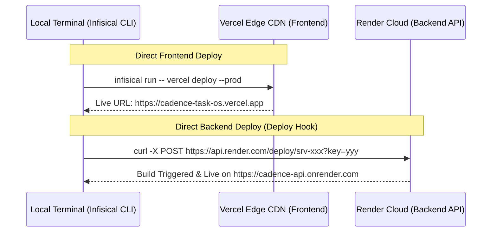

# Release, SecretOps (Infisical) & Direct Deployment Runbook

This document defines the canonical operational procedures for:
1. **Infisical Secret Management**: Storing, syncing, and injecting environment credentials without putting secrets in Git or local `.env` files.
2. **Direct CLI Deployment**: Deploying the frontend (Vercel) and backend (Render) directly from your local terminal with **zero GitHub push dependency**.
3. **Release & Publication Lifecycle**: Versioning, verification gates, and artifact publishing.

---

## 1. Secret Management with Infisical

[Infisical](https://infisical.com) is an open-source SecretOps platform. Instead of copying raw API keys into `.env` files or multiple web dashboards, Infisical centralizes all credentials in encrypted vaults and injects them directly into application memory at runtime.

### 1.1 Install the Infisical CLI

#### On Windows:
```powershell
# Using Winget
winget install Infisical.Infisical

# Or using Scoop
scoop bucket add infisical https://github.com/Infisical/scoop-infisical.git
scoop install infisical
```

#### On macOS / Linux:
```bash
# macOS (Homebrew)
brew install infisical/hook/infisical

# Linux (Debian/Ubuntu)
curl -1sLf 'https://dl.cloudsmith.io/public/infisical/infisical-cli/setup.deb.sh' | sudo -E bash
sudo apt-get update && sudo apt-get install -y infisical
```

---

### 1.2 Initialize Cadence in Infisical

1. **Log in to Infisical**:
   ```bash
   infisical login
   ```
2. **Initialize repository**:
   In the root of `Cadence-Task-OS`:
   ```bash
   infisical init
   ```
   Select your Infisical organization and select or create the project named **`cadence`**.

---

### 1.3 Import Existing Secrets into Infisical

Push your existing `.env` credentials into Infisical for the `dev` and `prod` environments:

```bash
# Import into development environment
infisical import --env=dev .env

# Import into production environment
infisical import --env=prod .env
```

The secrets stored in Infisical:
- `DATABASE_URL`: Supabase session pooler connection string.
- `SUPABASE_URL`: Supabase project URL.
- `SUPABASE_ANON_KEY`: Supabase client anonymous public key.
- `SUPABASE_SERVICE_ROLE_KEY`: Supabase service role secret key.
- `CLERK_PUBLISHABLE_KEY`: Clerk authentication public key.
- `CLERK_SECRET_KEY`: Clerk backend authentication secret key.
- `VITE_CLERK_PUBLISHABLE_KEY`: Frontend Clerk publishable key.
- `DISPATCH_SECRET`: 64-character hex secret for `pg_cron` jobs.
- `CORS_ORIGINS`: Allowed web origins.
- `LOG_LEVEL`: `info`.

---

### 1.4 Running Cadence with Infisical (Zero Secrets on Disk)

You no longer need a raw `.env` file on your hard drive. Infisical dynamically injects the secrets into the process environment in memory:

#### Run Database Status / Migrations:
```powershell
infisical run --env=prod -- pnpm run db:status
infisical run --env=prod -- pnpm run test:db
```

#### Run Local Development API:
```powershell
infisical run --env=dev -- pnpm --filter @workspace/api-server run dev
```

#### Export on Demand (if needed by legacy tools):
```powershell
infisical export --env=prod --format=dotenv > .env
```

---

### 1.5 Automated Secret Syncing to Vercel & Render

Infisical features native integrations with Vercel and Render:
1. In the **Infisical Dashboard**, navigate to **Integrations**.
2. Click **Vercel** → Select your Vercel project (`cadence-task-os`) → Map `prod` environment. Infisical will automatically sync `VITE_CLERK_PUBLISHABLE_KEY` and other frontend vars.
3. Click **Render** → Select your Render service (`cadence-api`) → Map `prod` environment. Infisical will sync `DATABASE_URL`, `CLERK_SECRET_KEY`, `DISPATCH_SECRET`, etc.
4. **Whenever you change a secret in Infisical, it immediately updates Vercel and Render automatically!**

---

## 2. Direct CLI Deployment (No GitHub Push Dependency)

If you do not want GitHub to act as a deployment middleman or trigger, you can deploy both the frontend and backend directly from your terminal.



---

### 2.1 Direct Frontend Deployment to Vercel via CLI

Vercel provides a CLI that packages and uploads your local workspace directly to Vercel's global CDN **without pushing to GitHub**:

1. **Install Vercel CLI**:
   ```bash
   pnpm add -g vercel
   ```
2. **Log in to Vercel**:
   ```bash
   vercel login
   ```
3. **Deploy Directly to Production**:
   Run this single command from your repo root:
   ```powershell
   infisical run --env=prod -- vercel deploy --prod
   ```
   What this does:
   - Infisical injects production environment variables.
   - Vercel CLI reads your local files and [`vercel.json`](file:///c:/PROJECTS/PIOS/ClonU/Driftloom/Cadence-Task-OS/vercel.json).
   - Vercel compiles the app and publishes it directly to production.
   - Outputs your live URL (e.g., `https://cadence-task-os.vercel.app`).
   - **Zero Git commits or pushes were sent to GitHub!**

---

### 2.2 Direct Backend Deployment to Render via Deploy Hook

Render offers **Deploy Hooks** (private webhook URLs) that allow you to trigger zero-downtime builds directly from your terminal without pushing to GitHub:

1. **Create a Deploy Hook in Render**:
   - Go to your Render Dashboard → open your Web Service (`cadence-api`).
   - Click **Settings** → scroll down to **Deploy Hook**.
   - Click **Add Deploy Hook** (give it a name, e.g. `local-cli-trigger`).
   - Render gives you a secret URL:
     `https://api.render.com/deploy/srv-xxxxxxxxxxxx?key=yyyyyyyyyyyy`
2. **Store the Hook URL in Infisical**:
   ```bash
   infisical secrets set --env=prod RENDER_DEPLOY_HOOK_URL="https://api.render.com/deploy/srv-xxxxxxxxxxxx?key=yyyyyyyyyyyy"
   ```
3. **Trigger Deploy from Local Terminal**:
   ```powershell
   # Trigger direct deployment
   curl -X POST "https://api.render.com/deploy/srv-xxxxxxxxxxxx?key=yyyyyyyyyyyy"
   ```
   Render instantly starts building and deploying the backend.

---

## 3. Release & Publication Lifecycle

### 3.1 Versioning Principles
Cadence uses **Semantic Versioning** (`MAJOR.MINOR.PATCH`):
- `MAJOR`: Breaking architectural changes or incompatible API schema migrations.
- `MINOR`: New user-facing modules or capabilities (e.g. Recurrence, Agent Memory, Telegram Bot).
- `PATCH`: Bug fixes, security patches, styling refinements, and performance tuning.

Current baseline: **`v0.1.0`** (documented in [`CHANGELOG.md`](file:///c:/PROJECTS/PIOS/ClonU/Driftloom/Cadence-Task-OS/CHANGELOG.md)).

---

### 3.2 Pre-Release Verification Gates

Before publishing or deploying any release, all verification gates must pass:

```powershell
# 1. Typecheck across all workspace projects
pnpm run typecheck

# 2. Database schema invariants & unit test suites
infisical run --env=prod -- pnpm run test:db
pnpm run test

# 3. Production build test
pnpm --filter @workspace/api-server run build
pnpm --filter @workspace/cadence run build
```

---

### 3.3 Publication & Distribution Channels

| Channel | Format | Description |
| :--- | :--- | :--- |
| **PWA Web App** | Global Edge CDN (Vercel) | Full-screen standalone PWA accessible at your custom domain. |
| **Android APK** | Native `.apk` Package | Built via [PWABuilder](https://www.pwabuilder.com) from the deployed PWA URL. Installs on any Android device. |
| **Backend API** | Node.js ESM Container | Express 5 running on Render / Docker with RLS database isolation. |
| **Telegram Bot** | Bot Webhook | Two-way interaction endpoint paired with Telegram Bot API. |
