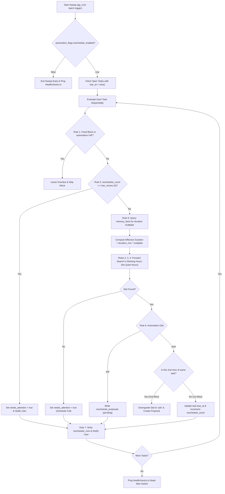

# Cadence — Auto-Reschedule Engine

> **Canonical algorithm contract.** Describes all 9 rules of the reschedule engine. The implementation in `artifacts/api-server` must match this document. Any rule change requires an `AUDIT.md` entry and an update here.  
> **Last verified:** 2026-09-19.

---

## 1. Overview

The auto-reschedule engine is a background sweep that detects missed tasks and moves them forward to the next available slot — visibly, reversibly, and with strict guardrails. It is **not** a full-autopilot scheduler (like Motion); it is a targeted correction mechanism for tasks that have slipped.

**Non-negotiable constraints:**
- Every move is logged and notified. No silent diffs.
- Fixed/immovable events are never touched.
- The automation dial always governs — user preference is never overridden.

---

## 2. Trigger Cadence

The sweep runs on a **fixed batch cadence** via `pg_cron`:

| Job | Schedule | Purpose |
|---|---|---|
| `reschedule-sweep` | Every 15–30 minutes | Check for and act on missed tasks |
| `end-of-day sweep` | 23:50 daily (user's local timezone) | Final daily cleanup pass |

**No instant-on-miss triggering.** One bad hour does not cascade into a flood of micro-moves. The fixed cadence is the anti-thrash mechanism.

Internal endpoint: `POST /internal/reschedule-sweep` authenticated by `DISPATCH_SECRET` header (set in `pg_net` job config). Never exposed publicly.

---

## 3. The 9 Rules (in order of application)

The engine applies rules in strict sequence per task evaluated. **Rules are not weighted — a task that fails Rule 1 is never even touched, regardless of any other rule.**

### Rule 1 — Fixed events are immovable
Any task or time block explicitly marked as fixed/immovable (e.g., a calendar appointment, a deadline with `automation = 'off'`) is **never touched by the engine under any mode**. Period. This includes `automation = 'off'` tasks — they are flagged as overdue for the user, but never moved.

### Rule 2 — Respect working hours and quiet hours
Proposed new slots must fall within the user's `working_hours` window (from `notification_settings`). Quiet hours define a daily silence window where no scheduling outputs or notifications are sent — reminders queue until the window ends.

- Default working hours: `00:00–23:59` (24-hour flexibility, per `spec/locked-decisions.md D-02`)
- Default quiet hours: 22:00–07:00 (from `notification_settings.quiet_start` / `quiet_end`)
- Timezone: user's IANA timezone from `notification_settings.timezone` (default `Asia/Kolkata`)

### Rule 3 — Search forward within the task's flexibility window
The engine looks for the **next available slot** of matching duration, starting from now, and not exceeding the task's `due_at` date. It does not search backward. A task past its `due_at` with no forward slot in the flexibility window gets flagged instead.

### Rule 4 — Priority-weighted placement
Higher-priority tasks get first pick of available slots in the search window. Lower-priority tasks can be placed further out, but **never past their own `due_at`**.

Priority CHECK: `IN ('low', 'medium', 'high')`.

### Rule 5 — Cap auto-moves at `max_moves` per task
Each task has a `reschedule_count` column (auto-incremented on each engine-initiated move, **not** on manual user edits). When `reschedule_count` reaches `reschedule_settings.max_moves` (default: **5**):
- The engine stops moving the task automatically.
- It sets `tasks.needs_attention = true`.
- It sends a notification: *"'X' has been rescheduled 5 times — it needs your attention."*
- No further auto-moves or proposals for this task until the user manually edits it (which resets the attention flag but does not reset the count).

### Rule 6 — Automation dial is always respected
The `automation` column on each task governs behavior. `NULL` inherits `reschedule_settings.default_mode`.

| Mode | Engine behavior |
|---|---|
| `off` | Task is flagged as overdue only; never moved, never proposed |
| `ask` | Engine writes a `reschedule_proposals` row with the proposed new slot; user confirms or declines (in-app or via Telegram reply). One pending proposal per task — re-running sweep doesn't duplicate. |
| `auto` | **First miss:** engine moves immediately and notifies after. **Second miss of same task:** engine automatically downgrades task's `automation` to `ask` — a repeated miss signals a problem that another silent move won't fix. |

Default for new tasks: `auto` (via `reschedule_settings.default_mode`). Global default can be changed in Settings.

### Rule 7 — Always log and notify
Every move, flag, or proposal writes to:
- `reschedule_runs` (one row per sweep execution with aggregate stats)
- A human-readable notification: *"Moved 'Finish PS1 writeup' to Thu 3–4pm — today's slots were full."*

**No silent diffs.** If the move cannot be notified (Telegram not linked, push not enabled), it still logs and shows a banner in-app.

### Rule 8 — Batch cadence, no thrashing
The engine runs on the fixed schedule defined in §2. It does not react to individual events (task creation, task edit, manual reschedule) in real time. This prevents cascading micro-adjustments that confuse the user about what's happening to their schedule.

### Rule 9 — Check `memory_facts` before placing (memory integration)
Before placing or re-estimating a task, the engine queries `memory_facts` for a matching pattern (by `key` or `category` aligned to the task's tags, project, or title). If a high-confidence fact supplies a `rule9_multiplier`:

1. The engine uses `duration_min * rule9_multiplier` as the **effective duration** for slot-finding (e.g., a `#hackathon` task with multiplier `2.3` is scheduled as 2.3× its estimated duration).
2. If no slot is available at the adjusted duration, the engine flags the task back to the UI/agent with: *"'X' usually runs longer than its estimate — want to bump it before scheduling?"*

This is the primary integration point between the memory subsystem and the scheduling engine. Rule 9 only activates when a matching fact with `confidence ≥ 70` exists.

---

## 4. Sweep Lifecycle (per task evaluated)

### Execution Steps
1. **Fetch:** Select all tasks matching `status = 'open' AND due_at < now() AND automation != 'off'`.
2. **Rule 1 Gate:** If task is fixed or `automation = 'off'`, leave intact.
3. **Rule 5 Gate:** If `reschedule_count >= 5`, stop auto-moves and flag `needs_attention`.
4. **Rule 9 Scaling:** Calculate `effective_duration = duration_min * rule9_multiplier` from `memory_facts`.
5. **Rules 2–4 Slotting:** Find the earliest free block inside working hours without encroaching on quiet hours.
6. **Rule 6 Dial Action:**
   - If dial is `ask` or 2nd miss: Create `reschedule_proposals` row and prompt user.
   - If dial is `auto` (1st miss): Mutate `tasks.due_at` and increment `reschedule_count`.
7. **Rule 7 Audit:** Emit immutable record to `reschedule_runs` and notify user via Telegram or in-app toast.
8. **Heartbeat:** Ping Healthchecks.io dead-man's switch upon sweep completion.

---

## 5. Kill Switch

`automation_flags` table has a `reschedule_enabled` key. If `enabled = false`, the sweep exits immediately after the health check ping without processing any tasks. Toggle via Supabase dashboard — no API path.

---

## 6. Pre-Conditions (Build Gate)

Per `spec/system-requirements.md §6 step 6`, the reschedule engine must not be built before:
- **Step 4** (Onboarding + Settings): `users.timezone`, `working_hours`, `quiet_hours`, automation defaults must exist
- **Step 5** (Reminders + heartbeat): the Healthchecks.io dead-man's-switch must be wired

Violating this ordering means the engine silently skips timezone logic or runs without a liveness monitor.
