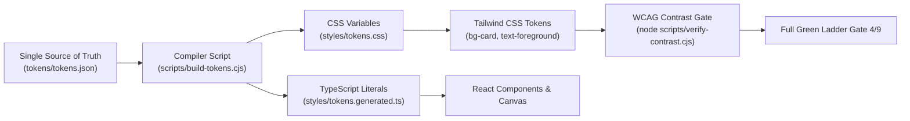
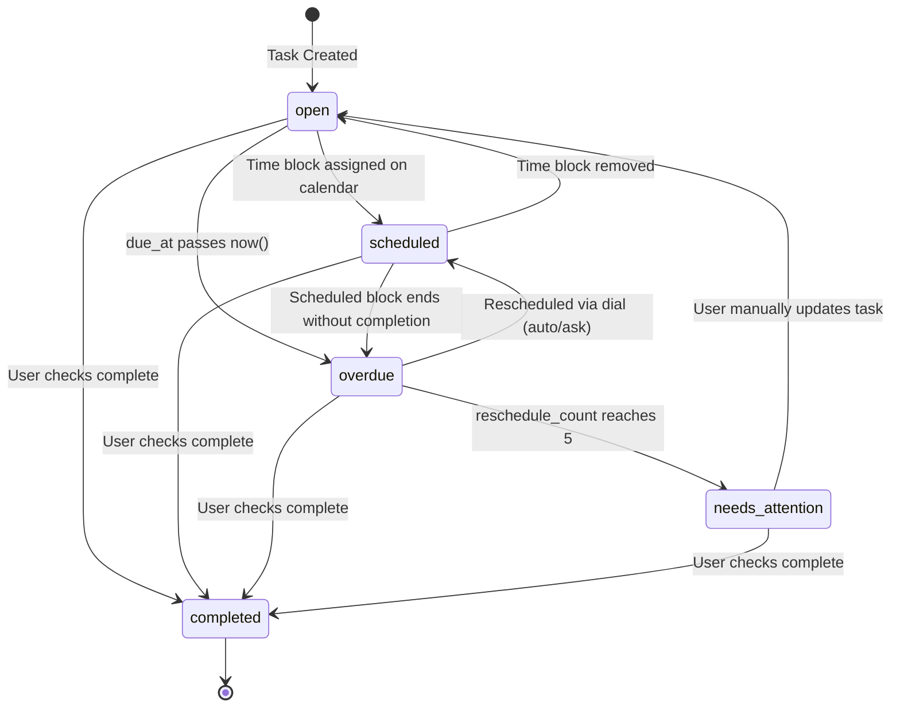

# Cadence — Design System

> **Canonical design contract.** Authoritative Apple HIG token set for Cadence. All frontend work must reference this document. Deviations require an `AUDIT.md` entry.  
> **Quality bar:** Things 3 + Apple Reminders/Clock/Timer.  
> **Last verified:** 2026-09-19.

---

## 1. Design Philosophy

Apple Human Interface Guidelines — three principles, in order:

1. **Clarity** — Typography, color, and iconography communicate meaning immediately. No decoration that doesn't carry information.
2. **Deference** — The interface steps back from the content. Chrome is minimal, surfaces are clean, transitions are purposeful.
3. **Depth** — Spatial cues (layering, shadow, blur) reinforce hierarchy. Used sparingly — only chrome elements get Glass.

**Energy-not-pretending rule:** Every "motivational" nudge must give the user real, actionable information or disappear. No "You've got this!" copy. Prominent **Start** CTA on Next Up. Streaks show a count, not praise.

---

## 2. Adaptive Color System

All colors adapt between Light and Dark modes. Dark mode is the **default** (OLED true black `#000000`).

Every status color **must** pair with a distinct icon/shape — color alone is never sufficient (Apple HIG mandate + colorblind accessibility, see `spec/locked-decisions.md D-14`).

### Surface Tokens

| Token | Light | Dark | Use |
|---|---|---|---|
| `--bg` | `#F5F5F7` | `#000000` | App background (OLED true black in dark) |
| `--surface` | `#FFFFFF` | `#1C1C1E` | Primary cards, panels |
| `--surface-elevated` | `#F2F2F7` | `#2C2C2E` | Modals, sheets, popovers |
| `--text-primary` | `#1D1D1F` | `#F5F5F7` | Headlines, body |
| `--text-secondary` | `#6E6E73` | `#98989D` | Captions, metadata, timestamps |

### Semantic Status Tokens

| Token | Light | Dark | Use | Required Icon Pairing |
|---|---|---|---|---|
| `--accent-energy` | `#FF9500` | `#FF9F0A` | Primary CTAs, Start buttons, active timers, streaks | 🔥 Flame / `ArrowUp` |
| `--success` | `#34C759` | `#30D158` | Task completions, focus round complete | ✅ `CheckCircle2` |
| `--urgent` | `#FF3B30` | `#FF453A` | Overdue tasks, at-risk deadlines only | ⚠️ `AlertTriangle` |
| `--scheduled` | `#007AFF` | `#0A84FF` | Scheduled time blocks, secondary links, calendar | 🕐 `Clock` |
| `--ai` | `#5E5CE6` | `#5E5CE6` | Memory facts, agent recommendations, AI labels | ✨ `Sparkles` / `Brain` |

> **Urgent (`--urgent`) is reserved for genuinely overdue / at-risk states only.** Do not use for emphasis or decoration.



---

## 3. Typography

```
Font stack: -apple-system, "SF Pro Display", "SF Pro Text", "Inter", sans-serif
```

| Role | Size | Weight | Line Height |
|---|---|---|---|
| Display / Hero | 34px | 700 (Bold) | 1.1 |
| Title 1 | 28px | 700 | 1.2 |
| Title 2 | 22px | 600 (Semibold) | 1.25 |
| Headline | 17px | 600 | 1.3 |
| Body | 17px | 400 (Regular) | 1.5 |
| Callout | 16px | 400 | 1.45 |
| Subhead | 15px | 400 | 1.4 |
| Footnote | 13px | 400 | 1.4 |
| Caption | 12px | 400 | 1.3 |

---

## 4. Geometry & Spacing

- **Base grid:** 8px
- **Spacing scale:** 4 / 8 / 12 / 16 / 20 / 24 / 32 / 48 / 64px
- **Corner radius:** 12px (cards), 8px (buttons/chips), 16px (modals/sheets), 50% (pill badges)
- **Minimum touch target:** 44×44px (Apple HIG minimum for tappable elements on mobile)
- **Card padding:** 16px (default), 12px (compact)

### 4.1 Responsive Breakpoints & Unified Container Layout System

- **Breakpoints:**
  - `sm`: 480px / 30rem (mobile landscape)
  - `md`: 768px / 48rem (tablet portrait, 2-column momentum active, bottom tab bar)
  - `lg`: 1024px / 64rem (desktop/laptop standard, sidebar collapsible, multi-column layouts)
  - `xl`: 1280px / 80rem (desktop large, widescreen triage sidebars active)
  - `2xl`: 1536px / 96rem (widescreen monitors)
  - Design floor: 360px.

- **Unified Docked Canvas & Header-Main Alignment Contract (Zero Dead Side Space):**
  - Both `<header>` inner wrapper and `<main>` share the docked canvas container (`w-full max-w-[1680px] mx-auto`) and fluid padding ladder (`px-4 sm:px-6 lg:px-8 xl:px-10`).
  - **Docked Canvas Architecture:** On desktop (with fixed 240px sidebar), the workspace canvas begins flush with the sidebar border (`x = 240px`). On standard 1920px screens (1920px − 240px = 1680px), the container fills 100% of the canvas with zero empty margins between the sidebar and content, and zero empty margins on the right edge.
  - **Zero Vertical Guide Offset:** Header breadcrumbs and page titles share the exact same left alignment guide, while header controls and page right-side actions share the exact same right alignment guide.
  - Zero disconnected floating controls or artificial centered islands surrounded by dead voids.

- **Fluid Padding Scale:**
  - Mobile (< 640px): `px-4` (16px) — maximizes touch target space and card width.
  - Tablet Portrait (640px - 768px): `sm:px-6` (24px) — comfortable breathing room without shrinking cards.
  - Desktop Standard (1024px - 1280px): `lg:px-8` (32px) — balanced margin against sidebar.
  - Desktop Widescreen (1280px+): `xl:px-10` (40px) — expansive enterprise spaciousness.

- **Per-Page Responsive Container Specifications:**
  - **Today Page (`w-full`):** Dual-column command center (`grid grid-cols-1 lg:grid-cols-[1fr_320px] xl:grid-cols-[1fr_360px] 2xl:grid-cols-[1fr_380px]`). On mobile/tablet (<1024px), clean single-column hierarchy prioritizes Next Up card and tasks without cramped splitting; on desktop (`lg:`+), docked right sidebar anchors Activity Rings momentum.
  - **Inbox Page (`w-full`):** Responsive 12-column layout (`lg:grid-cols-12`). Left 8 cols: search filter and capture stream. Right 4 cols: sticky triage discipline card with inbox zero rules. Eliminates dead right-gutter voids.
  - **Focus Page (`w-full`):** Responsive 12-column immersive cockpit (`lg:grid-cols-12`). Left 7/8 cols: FocusTimer & controls. Right 5/4 cols: Up Next queue & discipline triad. Zero artificial side voids.
  - **Calendar Page (`w-full`):** Dual-pane desktop cockpit (`lg:grid lg:grid-cols-12 gap-6 xl:gap-8 items-start`). Left 5 cols hold scheduled and unscheduled tasks with quick-schedule drag targets; right 7 cols (with border-border-subtle divider) hold the 24-hour interactive time blocks grid.
  - **Review Page (`w-full`):** Balanced 2-column top grid (`lg:grid-cols-[0.9fr_1.1fr]`) for Progress Ring and The Ledger, spanning the full workspace.
  - **Settings Page (`w-full`):** Left-aligned card hierarchy with clean edge padding. Eliminates one-sided black voids and artificial centered squeezing while preserving optimal control layouts.
  - **Profile Page (`w-full`):** Account dashboard spanning the workspace width. Hero identity, 2-column chronotype metrics, and privacy ledger.
  - **Memory Page (`w-full`):** AI transparency banner, confirmation queue, and responsive 1-to-4 column fact grid (`grid-cols-1 md:grid-cols-2 lg:grid-cols-3 2xl:grid-cols-4`).

- **Scrollability & Viewport Hygiene Contract:**
  - Zero unconditional `overflow-hidden` declarations on top-level content areas or page `<main>` tags.
  - Natural fluid expansion across all viewports ensuring vertical mousewheel and touch scrollability (`overflow-y-auto`) under both populated and empty task states.

---

## 5. Liquid Glass — Restraint Contract

Glass effect is **strictly confined to chrome**:
- ✅ Sidebar / navigation rail
- ✅ Bottom dock / tab bar
- ✅ Headers / nav bars
- ✅ Modals and sheets (frosted backdrop)
- ❌ Never on body content cards or task list items
- ❌ Never on the main scrollable content area

**Glass recipe:**
```css
backdrop-filter: blur(24px) saturate(180%);
background: rgba(28, 28, 30, 0.72);    /* dark mode */
border: 1px solid rgba(255, 255, 255, 0.08);
```

---

## 6. Activity Rings

Three concentric rings on the Today screen. Inspired by Apple Fitness rings — provide at-a-glance daily momentum without a dashboard.

| Ring | Color | Tracks | Fills When |
|---|---|---|---|
| Outer — Tasks | `--accent-energy` (#FF9F0A) | Tasks completed today | All planned tasks for today are done |
| Middle — Focus | `--success` (#30D158) | Focus rounds completed today | Daily round target is hit |
| Center — Streak | Text count, `--accent-energy` | Consecutive days with ≥1 completion | — (always shows count) |

Rules:
- Rings animate on completion with a spring overshoot (brief 105% scale, settles to 100%).
- Streak is strict — no freeze mechanic (see `spec/locked-decisions.md D-06`).
- Rings are decorative momentum indicators only — not a blocker or gamification gate.

---

## 7. Web Audio Micro-interactions

All audio is synthesized via Web Audio API — no asset files required. Instant mute toggle is always visible.

| Event | Sound | Notes |
|---|---|---|
| Task complete | `C5 → E5 → G5` ascending chime | Spring hit, 120ms attack, 600ms decay |
| Focus round complete | Bell tone, 440Hz sustained 800ms | Lower, meditative |
| Button tap / action confirm | Click transient, 2000Hz, 40ms decay | Subtle, tactile |
| Error / destructive action | Descending two-tone, 300ms | Not a harsh buzz |

Mute state is stored in `localStorage` and persists across sessions.

---

## 8. Motion Principles

- **Purposeful only.** Transitions communicate state change; they do not decorate.
- **Duration:** 200–350ms for page/panel transitions; 150ms for micro-interactions (button presses, checkmarks).
- **Easing:** Spring physics preferred (`cubic-bezier(0.34, 1.56, 0.64, 1)`) for completions and rings. `ease-out` for panels entering, `ease-in` for panels leaving.
- **Reduce motion:** Respect `prefers-reduced-motion` — all animations collapse to instant transitions when set.

---

## 9. Component Conventions

### Task Card States
| State | Visual Treatment |
|---|---|
| `open` | Default surface, `--text-primary` title |
| `completed` | Strikethrough title, `--success` check icon, reduced opacity (0.6) |
| `overdue` | `--urgent` left border accent + `AlertTriangle` icon (never color alone) |
| `scheduled` | `--scheduled` clock icon + time label |
| `needs_attention` | `--urgent` banner + `AlertTriangle`, pulsing (reduced motion: static) |



### Quick-Add Bar
- Always visible at the bottom of Today and Inbox views.
- Single text field. Enter key submits.
- Natural-language parsing (date/time/priority extracted inline).
- Keyboard shortcut: `N` globally opens it.

### Focus Timer Display
- Full-screen during active round.
- Shows: task title, elapsed/remaining time, round number, daily count.
- Control: Start / Pause / End Round.
- Background survival: timer state persists via `localStorage` + Service Worker.

---

## 10. PWA Shell

- `manifest.json`: `display: standalone`, `theme_color: #000000`, `background_color: #000000`
- Icons: 192×192 and 512×512 (maskable)
- Service Worker: network-first for API, cache-first for static assets; Background Sync queue for offline writes
- Install prompt: shown after 3 days of use, not on first open
