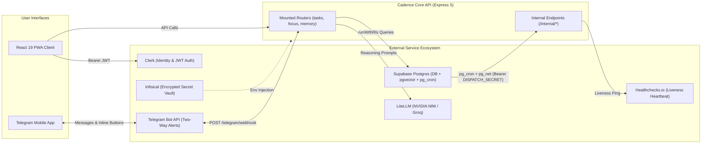
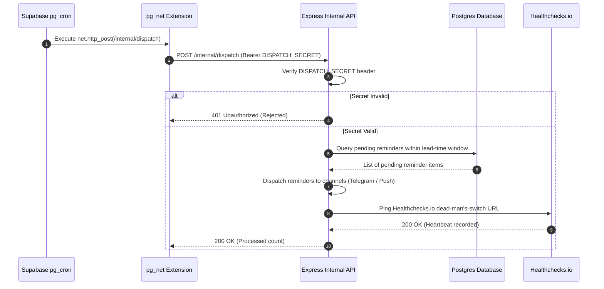
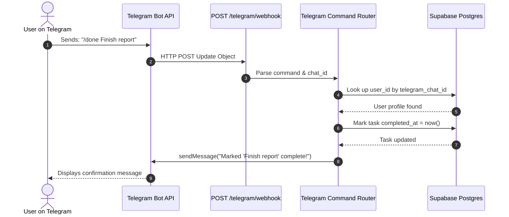

# Cadence — Integrations & APIs

> **Canonical external service contract.** Documents every third-party service integration, its role, endpoints, and what is explicitly banned. Any new integration requires an `AUDIT.md` entry and an update here.  
> **Last verified:** 2026-09-19.

---

## 1. Auth — Clerk

**Role:** User identity and session management.  
**Integration pattern:** Clerk native third-party-auth integration with Supabase. Clerk's session token is accepted directly by Supabase as a third-party auth provider.

| Endpoint / Behavior | Notes |
|---|---|
| `requireAuth` middleware | Applied to **all routes** except `GET /healthz` and `GET /api/healthz` |
| JWT claim | `auth.jwt()->>'sub'` — the Clerk user ID; used as `user_id` in all RLS policies |
| Sign-in/up UI | Clerk's hosted components (branded); embedded in `/landing` |
| Protected routes | All routes under `/` except landing and health checks |

**Never bypass:** `runWithRls` must be used for all user-facing DB queries. The owner-level pool is not acceptable for API handlers.

---

## 2. Database — Supabase Postgres

**Role:** Primary and only database. Never Replit's own database.

| Feature | Config |
|---|---|
| Connection | Drizzle ORM via `DATABASE_URL` env var pointing at Supabase project |
| RLS | Enabled on all 20 tables; enforced per-request via `runWithRls` |
| Extensions | `pgvector` (semantic memory embeddings), `pg_cron` (scheduled jobs), `pg_net` (HTTP calls from cron jobs) |
| Branching | Test/scratch branches only — close same day; they bill ~\$0.32/day |

---

## 3. Scheduling — `pg_cron` + `pg_net`

**Role:** Background job scheduler for reminders and reschedule sweeps. Runs inside Supabase Postgres — no separate server or Replit Scheduled Deployments.

| Job | Schedule | HTTP target | Auth |
|---|---|---|---|
| Reminder dispatcher | Every ~10 minutes | `POST /internal/dispatch` | `DISPATCH_SECRET` header |
| Reschedule sweep | Every 15–30 minutes + 23:50 daily | `POST /internal/reschedule-sweep` | `DISPATCH_SECRET` header |
| Memory extraction | Nightly (e.g., 02:00 user's TZ) | `POST /internal/memory-extract` | `DISPATCH_SECRET` header |

`DISPATCH_SECRET` is set in the Supabase `pg_net` job config and verified by the Express handler before processing. Internal endpoints never exposed publicly.

---

## 4. Reminders — Telegram Bot API

**Role:** Primary reminder and notification channel. Two-way — user can reply to act on tasks.

| Feature | Detail |
|---|---|
| Bot type | Standard Telegram Bot API (free, no Business API required) |
| Webhook | `POST /telegram/webhook` — Telegram pushes updates here |
| Outbound | `sendMessage` API call with formatted task reminder |
| Inbound commands | `done` (marks task complete), `snooze 1h` (postpones reminder 1 hour), `list today` (returns today's open tasks) |
| Chat ID storage | `notification_settings.telegram_chat_id` (TEXT — Telegram IDs can exceed int32) |
| Onboarding | Telegram wizard in `/onboarding` — user DMs bot to link their account |

**Why Telegram:** free, cross-platform, far more reliable than iOS PWA push (which requires home-screen install and has documented listener reliability issues). See `docs/archive/01-idea-research-and-spec.md §10`.

---

## 5. Reminders — Web Push / VAPID

**Role:** Secondary reminder channel for installed PWA users.

| Feature | Detail |
|---|---|
| Standard | Web Push Protocol with VAPID keys |
| Reliability | Strong on Android; iOS requires home-screen install (16.4+) and has reliability caveats after device restart |
| Status | Secondary only — never the sole channel relied on |

---

## 6. Reminders — Email Digest

**Role:** Tertiary fallback and weekly review summary delivery.

- Provider: Resend or SendGrid (to be finalized)
- Never time-critical
- Good for daily/weekly task rollup summaries
- Not used for individual task reminders

---

## 7. LLM Gateway — LiteLLM

**Role:** Single gateway in front of all LLM calls. Provides automatic failover across the free-tier chain.

| Tier | Provider | Model | Use |
|---|---|---|---|
| Primary | NVIDIA NIM | Llama 3.1 70B+ / Nemotron | Agent tool-calling, memory extraction |
| Fallback 1 | Groq / OpenRouter | Llama 3.1 variants | Automatic on rate-limit |
| Fallback 2 | Hugging Face | Free tier models | Final fallback |

**Requirements:**
- All models in the chain must support OpenAI-format function/tool calling
- Memory extraction (Source B) uses the cheapest available tier in the chain (it's non-destructive)
- Agent tool-calling uses the most capable available tier (it takes real, reversible actions)

**Spend tracking:** every LLM call writes to `llm_usage` with model, token counts, cost estimate, and endpoint label. Monthly ceiling: \$5.00 (~₹400). Safety-net alert at ₹300–500.

---

## 8. Monitoring — Healthchecks.io

**Role:** Dead-man's-switch for cron job liveness.

| Behavior | Detail |
|---|---|
| Ping | Every cron job execution pings a Healthchecks.io endpoint **after** completing successfully |
| Miss alert | If a ping is missed for > 2× expected interval, Healthchecks.io sends a Telegram alert to the owner |
| Coverage | Reminder dispatcher, reschedule sweep, memory extraction |

This is the primary liveness signal for background automation. Without it, a silent cron failure would go undetected until the user noticed missed reminders.

---

## 9. Error Monitoring — Sentry

**Role:** Runtime error capture for both Express API and React frontend.

| Integration | Notes |
|---|---|
| API | Sentry SDK wired into Express error handler |
| Frontend | Sentry SDK in React (Vite plugin) |
| Alerting | Email/Slack on new issues (configured in Sentry project settings) |

---

## 10. Explicitly Deferred / Banned Integrations

These integrations are **closed decisions** — do not build, evaluate, or propose without explicit owner instruction. See `spec/locked-decisions.md D-24`.

| Integration | Reason deferred |
|---|---|
| **Helicone / LangSmith** | LLM observability platform — `llm_usage` table covers the needed spend + token tracking at this scale. Revisit if the self-built version becomes insufficient. |
| **Dedicated OCR vendor** | Paper-photo-import uses Claude Vision API (not a dedicated OCR service). Re-evaluate only if accuracy is insufficient. |
| **Google Calendar sync** | Two-way sync is complex and fragile. `time_blocks` covers the internal calendar. Revisit only if user explicitly prioritizes it. |
| **Payments / billing** | No monetization planned at this stage. |
| **Stripe / RevenueCat** | See above. |

---

## 11. Environment Variables Required

| Variable | Used by | Notes |
|---|---|---|
| `DATABASE_URL` | Drizzle / Supabase | Supabase Postgres connection string |
| `CLERK_SECRET_KEY` | `requireAuth` middleware | Server-side Clerk auth |
| `NEXT_PUBLIC_CLERK_PUBLISHABLE_KEY` | Frontend Clerk SDK | Client-side Clerk |
| `DISPATCH_SECRET` | Internal cron endpoints | Shared secret between `pg_net` and Express |
| `TELEGRAM_BOT_TOKEN` | Telegram Bot API | From BotFather |
| `HEALTHCHECKS_URL` | Cron job ping | Healthchecks.io check URL |
| `SENTRY_DSN` | Sentry SDK (both) | — |
| `VAPID_PUBLIC_KEY` / `VAPID_PRIVATE_KEY` | Web Push | Generated once per deployment |
| `LITELLM_*` | LiteLLM gateway | Provider API keys (NVIDIA NIM, Groq, HF) |
| `CORS_ORIGINS` | Express CORS | Allowlist (default: `http://localhost:5173`) |
