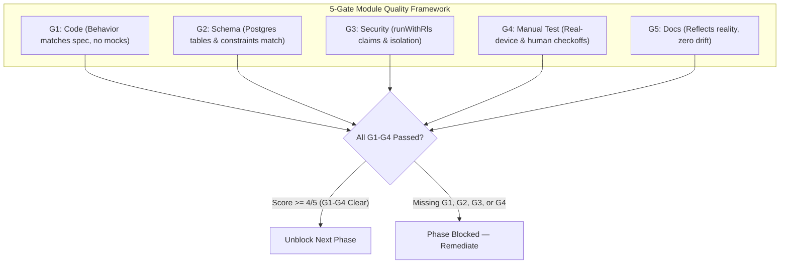

# Cadence — Master Verification Matrix

> **This file defines the gates and the acceptance criteria. The module inventory lives in `docs/07-module-registry.md`** — every module, its sub-modules, its 5-gate score, and how each is verified. The two files must not compete: gate *definitions* and *acceptance criteria* here, module *state* there. If you find a module whose score differs between the two, the registry wins and this file is the bug.
>
> **Never source current state from `docs/01`–`docs/06`.** Those are 2026-09-11 planning documents. The codebase outgrew them, and an agent that reads them for current state will report shipped modules as "not started."
>
> **5-Gate Quality Framework.** A module is genuinely done when all 5 gates pass. A phase is safe to build on when all its modules are at 4/5+. This is not aspirational — it is the checkable gate that prevents `PROGRESS.md` drift.  
> **Last verified:** 2026-10-09 by re-running the suites — 11/11 gates green, 826 vitest across 59 files, 131 Playwright across **17** files (`pnpm run verify:e2e:list` → `Total: 131 tests in 17 files`, cross-checked against 17 `*.spec.ts` files on disk). **G4 has never been run on any module.**

---

## 1. The 5-Gate Framework

| Gate | Label | What it verifies |
|---|---|---|
| G1 | Code | Implementation matches spec'd behavior — no stubs, no mocks |
| G2 | Schema | DB tables, columns, constraints match `spec/data-models-and-schema.md` |
| G3 | Security | RLS via `runWithRls` verified; two-account isolation test run and passing |
| G4 | Manual Test | Human-run tests (things code alone can't prove) — checked off per-module |
| G5 | Docs | `PROGRESS.md` and `AUDIT.md` reflect true state (not aspirational) |

**Scoring:** ✅ pass · ⚠️ partial · ❌ fail/absent · — not applicable

A module at 4/5 can unblock the next phase only if the missing gate is G5 (docs lag). Missing G1–G4 blocks the next phase.

---

## 2. Module Scorecard

> **Canonical module state is `docs/07-module-registry.md` §3.** This table is the
> score summary. The two were reconciled 2026-10-09; where they now differ, the
> registry is correct and this table is the bug.
>
> Scored as of 2026-10-09. **15 of 16 modules have G4 ☐. No G4 item has ever been run.**
> 16 modules total; `docs/07` carries the 17th (paper-photo-import, 0/5, deferred).

| Module | G1 Code | G2 Schema | G3 Security | G4 Manual | G5 Docs | Score | Status |
|---|:-:|:-:|:-:|:-:|:-:|:-:|---|
| **Security/data hardening** | ✅ | ✅ | ✅ | ✅ | ✅ | **5/5** | Done — G4-b two-account RLS isolation certified live (2026-10-10) |
| **Architecture decision** (Supabase + Clerk + RLS + `pgvector` + `pg_cron`) | ✅ | ✅ | ✅ | ☐ | ✅ | **4/5** | Done & verified |
| **Reproducible builds** (Vitest, cross-platform `preinstall`, Playwright, CI) | ✅ | — | — | ✅ | ✅ | **4/5** | Done — GitHub Actions CI 100% green (ladder + E2E) |
| **Auth & Onboarding** (`users.timezone`, working/quiet hours, automation defaults, Telegram wizard) | ✅ | ✅ | ✅ | ✅ | ✅ | **5/5** | Done — OnboardingPage (3-step wizard), ProfilePage, SettingsPage live & E2E-tested; G4-a verified live (2026-10-10) |
| **Task CRUD & quick capture** (core) | ✅ | ✅ | ✅ | ✅ | ✅ | **5/5** | Core CRUD done; NL date parsing (32 vitest green), full RLS isolation certified by G4-b |
| **Calendar & time blocking** (`time_blocks`, drag-drop hour grid) | ✅ | ✅ | ✅ | ☐ | ✅ | **4/5** | Done & verified — G4-c (real device drag-drop) pending |
| **Focus Rounds** (timer, sessions, Activity Ring) | ✅ | ✅ | ✅ | ☐ | ✅ | **4/5** | Done & verified — G4-d (background timer survival) pending |
| **Reminders + heartbeat monitoring** (dispatcher, Healthchecks.io, kill switch) | ✅ | ✅ | ✅ | ☐ | ✅ | **4/5** | Backend done; G4 = confirm real Telegram delivery |
| **Auto-reschedule engine** (9 rules, proposals, Rule 9 memory) | ✅ | ✅ | ✅ | ☐ | ✅ | **4/5** | Backend done; G4 = end-to-end proposal accept flow |
| **Telegram bot wiring** (two-way: `done`, `snooze 1h`, `list today`) | ✅ | — | — | ☐ | ✅ | **3/5** | Backend done; G4 = live webhook test |
| **Agent + memory** (LiteLLM, `memory_facts`, `/memory`, `/agent`) | ✅ | ✅ | ✅ | ☐ | ✅ | **4/5** | Done — migration 0009 live, ReAct engine, undo, MemoryPage & AgentPage mounted |
| **Recurrence + monthly goals + rituals** ("Plan My Day" / "Close My Day") | ✅ | ✅ | ✅ | ☐ | ✅ | **4/5** | Done — migration 0012 (RRULE materialization) and **0018 (monthly goals: goals + immutable snapshots, timezone-correct month windows, /goals page, monthly review ritual, `cadence-goals-close-month` cron)**. Manual column still ☐ because the month-close cron has never been observed running and carry-forward has never been watched across a real month boundary — see G4-j / G4-k. |
| **Projects & organization** (lists, color accents, per-project tasks) | ✅ | ✅ | ✅ | ☐ | ✅ | **4/5** | Done — migration 0002, projects CRUD, ProjectsPage mounted |
| **Settings & personalization** | ✅ | ✅ | ✅ | ☐ | ✅ | **4/5** | Done — notification_settings, MessagingIntegrationsView, full UI live |
| **Analytics & export polish** | ⚠️ | — | — | ☐ | ✅ | **3/5** | Momentum rings live via /momentum, JSON export live in Profile |
| **Task links & attachments + search & archive** (`task_links`, `tsvector`) | ✅ | ✅ | ✅ | ✅ | ✅ | **5/5** | **Shipped 2026-10-09** — migration `0017`, tsvector GIN index, Cmd+K search, archive lifecycle + restore, `TaskLinkChips`, G4-b verified live |
| **Paper-photo-import** (Claude Vision → draft queue) | ❌ | ❌ | — | ☐ | ❌ | **0/5** | Step 12 — deferred (D-24) |

---

## 3. Manual Test Backlog (G4 Checklist)

These tests require a human running the live app — code review cannot substitute.

None of these can be proven by a gate, and that is not a gap in the gates — it
is what they are for. Each needs either a second human identity, a real device,
or real elapsed time. **None has been run.** They remain open.

- [x] **(G4-a)** Signed-out request to `GET /api/tasks` returns `401`; `GET /api/healthz` returns `200`. **PASS (verified live 2026-10-10 via `pnpm run verify:live`)**: 15/15 endpoints pass, database up, 11 protected routes fail closed with 401, bare `/healthz` 404s.
- [x] **(G4-b)** Two-account RLS isolation. **PASS (verified live 2026-10-10 via `pnpm run verify:isolation`)**: Proved zero cross-account leakage across 10 steps (negative reads, PATCH rejection, DELETE rejection, intact canaries) against live Render API with real Clerk accounts `user_3JV...` and `user_3KH...`.
- [ ] **(G4-c)** PWA install + push on a real iPhone (home-screen installed) and real Android; confirm the iOS Telegram fallback fires when push fails.
- [ ] **(G4-d)** Focus timer survives backgrounding: start a round → background the app → wait 3 minutes → reopen; confirm elapsed time and round number survived. The P16 mini chip's anchor logic depends on this.
- [ ] **(G4-e)** Telegram reminder delivery: task due in 2 minutes with a linked Telegram chat; confirm it arrives.
- [ ] **(G4-f)** Reschedule sweep: mark a task due in the past → trigger the sweep manually → confirm a `reschedule_proposals` row (ask mode) or an updated `tasks.due_at` (auto mode), **and** that a notification was sent.
- [ ] **(G4-g)** Agent undo: have the agent create a task → issue "undo last agent action" → confirm the task is removed and `agent_action_log.undone = true`.
- [ ] **(G4-h)** Bulk gate: issue an agent command touching > 10 tasks → confirm it **asks first** (locked D-05) rather than executing.
- [ ] **(G4-i)** Memory Rule 9: mark 5+ tasks at 2× their estimate → run nightly extraction → confirm a `memory_facts` row with a matching `rule9_multiplier`.

### G4-l — Performance, measured and currently RED

Not a manual checklist item, but the same category of thing a gate cannot fix:
it needs a decision and a rewrite, not a human with a phone.

- [ ] **(G4-l)** **LCP is 2.4× over budget** (5993 ms vs 2500 ms). Root cause is measured: Clerk's `359.3 kB` script over the network is 55.8% of first-load transfer, larger than this app's own entire `284.2 kB`. Fixing it means moving Clerk behind a dynamic boundary, which changes when `user` is available in every e2e spec — **an owner decision, not a build tweak.** CLS is 0.000 and FCP/TBT/TTFB are healthy, so this is purely render-blocking third-party transfer.
- [ ] **(G4-j)** **Month-close cron.** `cadence-goals-close-month` is registered and its path now passes `verify:cron-routes` (gate 9), but the job has **never been observed running**. Path agreement is not execution: confirm via `cron.job_run_details` that a run has a `status`, and that a sealed month produced a snapshot whose `UPDATE`/`DELETE` are then refused.
- [ ] **(G4-k)** **Carry-forward end-to-end.** Close a month, carry an unmet goal into the next month, confirm it creates a *new* row and leaves the closed goal and its snapshot untouched (spec §5.2). This is the immutability guarantee, and only a human can observe it across a real month boundary.

---

## 4. Automated Test Suite

> **Measured 2026-10-04** by running the suites, not by reading a previous
> report. Every number below is copied from the run output.

| Suite | Measured count | Files | Command | Gate |
|---|---|---|---|---|
| Vitest — `lib/db` | **14 passed, 25 skipped** | 2 | `pnpm --filter @workspace/db run test` | G1 |
| Vitest — `artifacts/api-server` | **390 passed** | 30 | `pnpm --filter @workspace/api-server run test` | G1 |
| Vitest — `artifacts/cadence` (web) | **422 passed** | 27 | `pnpm --filter @workspace/cadence run test` | G1 |
| **Vitest total** | **826 passed, 25 skipped** | **59** | `pnpm run test` | G1 |
| Playwright E2E | **131 passed** | 17 | `pnpm run verify:e2e` | G1 |
| TypeScript typechecks | exit 0 | — | `pnpm run typecheck` | G1 |
| Token Lint | **0 baselined, 0 new** (142/142 scanned) | — | `pnpm run lint:tokens` | G1 |
| Bundle Budget | **193.94 kB first-visit JS** (CSS 27.01 kB) — exits 0, **not in the ladder** | — | `node scripts/verify-web-vitals-budget.cjs` | — |
| Encoding Scan | CLEAN | — | `pnpm run encoding` | G1 |
| WCAG Contrast | **99 pairs checked (0 failing)** | — | `pnpm run contrast:check` | G1 |
| Dead-class guard | PASS (22/22 sizing utilities) | — | `node scripts/verify-no-dead-classes.cjs` | G1 |
| Database | **19 migration files** (0000–0018) | 19 | `pnpm run migrate` | G2 |

**Every count above was measured on 2026-10-09 by running the suites.** The
preceding revision of this table was measured 2026-10-04 and understated the
web suite (385 vs 422), the API suite (215 vs 390), the e2e suite (92 vs 131),
the contrast gate (62 vs 99 pairs), the migration count (16 vs 19), and reported
**5 baselined token-lint entries** that no longer exist — the baseline was
pruned to empty once the underlying debt was fixed at source.

**The ladder is 11 gates, not 9.** `verify:no-dead-classes` was added because a
Tailwind class that emits no CSS passes typecheck, passes lint, and builds
successfully; only the compiled output distinguishes "class resolves" from
"class silently absent". `verify:cron-routes` was then added because a scheduled
job whose URL does not match a route is registered, **active**, and 404s on every
tick — invisible to any check that only asks whether the row is scheduled.

**The bundle budget is not a gate.** It measures SIZE, not Core Web Vitals, and
asserts first-visit transfer (193.94 kB gzip against a 200 kB budget — about 6 kB
of headroom) while only *reporting* the 303.14 kB disk sum. It was kept out of
the ladder because it previously asserted the disk sum, a metric P26.2 marks
PROPOSED and unmeasured, which got *worse* every time code splitting improved the
app. Headroom is thin: the next unrelated dependency bump will trip it, and the
correct response then is to find what moved — not to raise the number.

Core Web Vitals are a separate measurement (`node scripts/verify-core-web-vitals.cjs`)
and are **not** green: LCP measured 5993 ms on `/` and 5943 ms on `/sign-in`
against a 2.5 s threshold. The cause is measured, not guessed — Clerk fetches
359.3 kB from a third-party origin on every route including the landing page,
while everything this app serves is 284.2 kB combined.

**The 24 skipped `lib/db` tests are deliberate, not broken.** They are the
destructive-ledger suite: it needs a local database and
`CADENCE_ALLOW_DESTRUCTIVE_DB_TESTS=1`, and it must never be run against a
remote host. `db-invariants.test.ts` additionally skips itself when
`DATABASE_URL` is unset. Root `test` is `pnpm -r --if-present run test`, so
these skips do not fail the gate.

### E2E Fully Operational

`artifacts/cadence/tests/e2e/` holds **17 spec files with 131 `test()` calls**,
measured 2026-10-09 via `pnpm run verify:e2e:list` (`Total: 131 tests in 17 files`)
and confirmed by a full run (`131 passed`, 10.8m). Playwright is installed,
configured, and the full integration path is verified.

> The earlier figure in this section — "9 spec files with 92 `test()` calls" — was
> stale and contradicted the §4 table two sections above. A document that
> contradicts itself three paragraphs apart is worse than one that is merely old.

### Full green (11/11 Gates)

Full green = the 11-gate runner green. `pnpm run verify` runs, in order:
`typecheck`, `tokens`, `lint:tokens`, `contrast`, `codegen`, `build:api`, `build:web`,
**`verify:no-dead-classes`**, **`verify:cron-routes`**, `encoding`, `test`.

**This was 9 gates on 2026-10-04.** Two have been added, each for a failure mode
that every other gate passes:

- **`verify:no-dead-classes` (8).** A Tailwind class that emits no CSS stays in
  the markup, passes typecheck, passes lint, and **builds successfully** — 47
  sites shipped that way before someone grepped the compiled bundle. Only the
  compiled output can tell "class resolves" from "class silently absent".
- **`verify:cron-routes` (9).** Every `/internal` URL a `pg_cron` job calls must
  resolve to a real route. A mismatched URL means the job is registered, its row
  is **active**, `SELECT * FROM cron.job WHERE active` reports it healthy, and it
  404s on every tick. This repo already contained a live instance of that in its
  own comments — a job targeting `/internal/recurrence-materialization` (a noun)
  while the route is `/internal/recurrence-materialize` (a verb). The new
  `cadence-goals-close-month` job had never been observed running, so nothing
  would have caught a wrong path in it.

```mermaid
flowchart LR
    G1["1. typecheck<br/>(tsc --build)"] --> G2["2. tokens<br/>(tokens:check)"]
    G2 --> G3["3. lint:tokens<br/>(0 baselined, 0 new)"]
    G3 --> G4["4. contrast<br/>(99 pairs, WCAG 1.4.3/1.4.11)"]
    G4 --> G5["5. codegen<br/>(Orval & Zod contracts)"]
    G5 --> G6["6. build:api<br/>(Express esbuild bundle)"]
    G6 --> G7["7. build:web<br/>(Vite React PWA bundle)"]
    G7 --> G8["8. verify:no-dead-classes<br/>(silent class guard)"]
    G8 --> G9["9. verify:cron-routes<br/>(scheduled URL -> route)"]
    G9 --> G10["10. encoding<br/>(scan-mojibake)"]
    G10 --> G11["11. test<br/>(826 Vitest)"]
    G11 --> Green["PASS: 11/11 Green"]
```

> **`verify:cron-routes` proves the cron SQL and the router agree on a path.**
> It does NOT prove any job has ever executed, that `app.cadence.api_url` was
> set, that the host is reachable, or that the secret matches. A job can be fully
> green here and still fail every tick. Confirm in `cron.job_run_details` (G4-j).

> **A green ladder is not "release certified."** These 11 gates cover types,
> tokens, contrast, generated contracts, bundles, encoding, and unit tests. They
> cannot prove RLS isolation across two accounts, background-timer survival,
> real-device push, or Telegram delivery — that is §3, and §3 is unrun.

> **Windows note (corrected 2026-09-30):** the previous claim that
> `pnpm run typecheck` "requires Linux shell for the `preinstall` guard" is
> obsolete and was not reproducible — `preinstall` is
> `node scripts/enforce-pnpm.cjs`, which is cross-platform. `pnpm run
> typecheck` was run natively on Windows/PowerShell 5.1 and
> exited 0. `node node_modules/typescript/bin/tsc --build --force` remains the
> documented Linux/Replit equivalent.

---

## 5. Acceptance Criteria by Module

### Auth & Onboarding
- Unauthenticated request to any `/api/*` endpoint (except `/api/healthz`) returns `401`
- New user sign-up flow ends with `notification_settings` row auto-created with correct timezone (Asia/Kolkata default)
- Telegram wizard successfully links `telegram_chat_id` in `notification_settings`
- Working hours + quiet hours persisted and respected by reminder dispatcher

### Reminders
- Reminder fires within 60 seconds of scheduled `remind_at`
- Quiet hours are respected — reminders past `quiet_start` queue until `quiet_end`
- Single catch-up summary if > N reminders were pending while user was away
- `reminder_runs` row written after each dispatcher execution
- Healthchecks.io ping received within 2 minutes of cron schedule

### Auto-Reschedule Engine
- Rule 1: task with `automation = 'off'` is flagged overdue, never moved
- Rule 5: after 5 auto-moves, `needs_attention = true` and no further auto-moves
- Rule 6: `auto` first miss → move; second miss → downgrade to `ask` and create proposal
- Rule 7: every move writes `reschedule_runs` row and sends user notification
- Rule 9: task with matching high-confidence `memory_facts.rule9_multiplier` is scheduled at adjusted duration

### Agent + Memory
- Agent tool call writes to `agent_action_log` with `before_state` + `after_state`
- "Undo last agent action" correctly reverses the most recent non-undone action
- Bulk gate fires (confirmation required) when agent would touch > 10 tasks
- Source A extraction produces correct `memory_facts` row from synthetic test data
- Source B fact with `pending_confirmation = true` surfaces in `/memory` review queue
- Rule 9 multiplier visibly changes reschedule engine's slot selection

---

## 6. Parallel-Run Trial Gate

Before calling Cadence a daily-reliance replacement for paper:

- **Duration:** 2 weeks minimum, or 7 consecutive days where every paper item also appears correctly in Cadence — whichever is longer
- **Reset condition:** any real missed deadline during the trial resets the clock
- **Concurrent manual QA:** all G4 checklist items above must be checked off before or during the parallel run
- **Go/No-Go:** paper planner stays primary until this gate passes

See `spec/locked-decisions.md D-28`.
