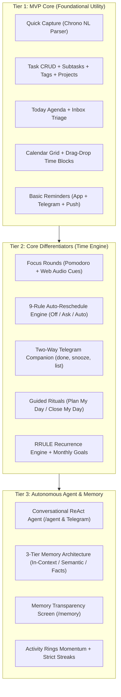
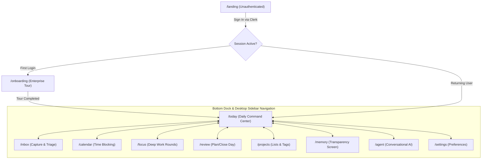
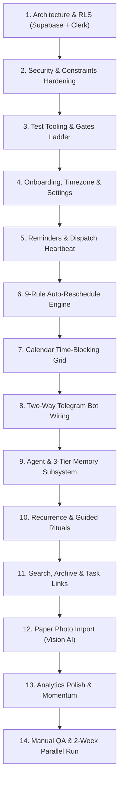

# Cadence — System Requirements

> **Doc type:** Authoritative functional requirements contract.  
> **Audience:** Developers, AI coding agents, code reviewers.  
> **Last verified:** 2026-09-19. Zero-trust posture applies — any status claim must be independently verified against live code.

---

## 1. System Invariants ("Always Do / Never Do")

These rules are unconditional — no feature, automation mode, or agent instruction overrides them.

### Always Do
- **Zero trust, permanently.** Every status claim (`PROGRESS.md`, `AUDIT.md`, prior agent summaries) is unverified until independently checked. This is the standing posture, not a one-time audit.
- **Never move a fixed/immovable calendar event**, under any automation mode or reschedule dial setting.
- **Never silently reschedule or bulk-edit.** Every automated move and every agent bulk-action logs what changed and notifies the user. No silent diffs, ever.
- **Confirm before any bulk agent action touching more than 10 tasks.** Confirmation must be explicit (user reply in chat or Telegram) — not inferred from silence.
- **Log every agent action** (create/edit/delete/reschedule) to `agent_action_log` with enough data to fully reverse it. Expose "undo last agent action" as a command in both the in-app chat panel and Telegram.
- **Re-run the zero-trust audit weekly** during active build weeks — not once at project start.
- **Every status color must pair with a distinct icon/shape.** Color alone is never sufficient (colorblind accessibility, Apple HIG mandate).

### Never Do
- Don't overwrite `AUDIT.md` or `PROGRESS.md` during an audit — append a new dated section. Before/after must remain comparable.
- Don't add features or fix things during an audit pass — audit sessions verify and report only.
- Don't build Reminders or the Auto-reschedule engine before timezone + working/quiet hours + the monitoring heartbeat all exist and are verified.
- Don't use Replit's own database — Supabase Postgres is the constant backend.
- Don't close a Supabase test/scratch branch and walk away — it bills ~\$0.32/day.
- Don't rely on push notifications alone — iOS PWA push is unreliable enough that Telegram stays the primary reminder channel.
- Don't auto-file anything from the paper-photo-import feature — draft tasks always require confirm-before-save.
- Don't batch-miss: if > N reminders are pending on reopen after days away, send one catch-up summary — never replay N individual pings.
- Don't treat this requirements file as perpetually accurate — re-verify weekly.

---

## 2. Feature Tiers

### Tier 1 — MVP (must work before Cadence replaces paper)
- Mobile-first quick capture: one field, natural-language date/time parsing, add from widget/shortcut
- Tasks with: title, notes, due date/time, duration estimate, priority, project/list, tags, links (URL/file), subtasks
- Projects/lists + tags
- Today view + Inbox (uncategorized capture)
- Calendar: Month / Week / Day views with drag-and-drop time blocking
- Basic reminders (in-app + Telegram + push) at task time and configurable lead time
- Mark complete / snooze / reschedule (manual)

### Tier 2 — Core Differentiators
- **Focus Rounds** — Pomodoro-style timer tied to a task; configurable round length/breaks; daily round target; focus stats; background-survival (app backgrounded, timer continues)
- **Telegram bot** — primary reminder channel; two-way commands: `done`, `snooze 1h`, `list today`
- **Auto-reschedule engine** — 9-rule algorithm (see `spec/auto-reschedule-engine.md`); visible and reversible; automation dial (Off / Ask / Auto) per task or globally
- Recurring tasks (daily/weekly/monthly/custom RRULE)
- Monthly goals + rollups; weekly planning ritual; daily "Plan My Day" and "Close My Day" flows (Sunsama-style)
- Escalating reminder tiers + quiet hours
- `agent_action_log` + undo exposed in both UI surfaces

### Tier 3 — Agent, Memory, Polish
- **Agent chat panel** (in-app) and **Telegram conversational agent** — same backend, same tool-calling interface
- **Memory system** — 3-tier (in-context / semantic / structured facts); nightly extraction; Rule 9 integration with reschedule engine; transparency screen `/memory`
- Eisenhower Matrix view (optional lens, not forced)
- Analytics: completion rate, streaks (strict, no freeze), focus-time trends, "what slipped and why"
- Full-text search (`tsvector`) + archive filter (completed tasks older than N days)
- Data export (JSON/CSV)
- Paper-photo-import (Claude Vision → draft queue with confirm-before-save)

---

## 3. Information Architecture — Core Screens

| Route | Screen | Purpose |
|---|---|---|
| `/` or `/today` | **Today** (home) | Vertical timeline of today; current focus round if active; quick-add bar always visible; Activity Rings |
| `/inbox` | **Inbox** | Uncategorized quick-captures waiting to be triaged |
| `/calendar` | **Calendar** | Month / Week / Day views; drag-drop time blocking |
| `/projects` | **Projects** | Project list; per-project task view |
| `/focus` | **Focus** | Round timer; today's round count; focus stats; start/pause/resume/finish |
| `/agent` | **Agent** | In-app chat panel (mirrors Telegram bot) |
| `/review` | **Review** | Daily shutdown / weekly planning ritual; monthly goal rollup |
| `/memory` | **Memory** | "What Cadence Knows About Me" — active facts, source, confidence; edit/delete; Source B confirmation queue |
| `/onboarding` | **Onboarding** | Timezone setup; working hours; quiet hours; automation defaults; Telegram wizard |
| `/profile` | **Profile** | Account info, API integrations, export |
| `/settings` | **Settings** | Working hours, quiet hours, notification channels, automation dial defaults, Telegram link, calendar export |
| `/landing` | **Landing** | Marketing/sign-in page for unauthenticated users |

---

## 4. Non-Functional Requirements

| Requirement | Value |
|---|---|
| Auth model | Clerk (single-user now; schema multi-user-ready from day one via `user_id` RLS) |
| Data isolation | Row-Level Security on every table, enforced per-request via `runWithRls` |
| Target platform | Mobile-first PWA (installable on Android/iOS home screen); web desktop supported |
| Offline | Service-worker cache (reads); Background Sync queue (writes); quick-add works offline |
| Background timer | Focus timer survives app backgrounding (manual test gate G4-d) |
| Notification reliability | Telegram primary; never depend on iOS push alone |
| Monitoring | Healthchecks.io dead-man's-switch on every cron run; Sentry for runtime errors |
| LLM spend | ~\$0 target (free tiers); ₹300–500/month safety-net alert; ₹400 hard ceiling |
| Test gate | 174 Vitest tests (12 files) passing; 15/15 Playwright E2E passing before shipping a phase |

---

## 5. Accepted Tech Stack (non-negotiable)

| Layer | Technology | Constraint |
|---|---|---|
| Frontend | React + Vite + Tailwind + shadcn/ui, PWA manifest + SW | Apple HIG aesthetic; dark-mode default OLED `#000000` |
| API | Express 5 (`artifacts/api-server`), esbuild CJS→ESM bundle | Port 5000; no Python/FastAPI rewrite |
| DB/ORM | Supabase Postgres + Drizzle ORM | RLS via `runWithRls`; never Replit DB |
| Auth | Clerk native Supabase integration | `requireAuth` on all routes except health checks |
| Scheduling | `pg_cron` + `pg_net` | Internal endpoints + `DISPATCH_SECRET`; not Replit Scheduled Deployments |
| Reminders | Telegram Bot API primary; Web Push/VAPID secondary; email digest fallback | — |
| Agent | LiteLLM gateway: NVIDIA NIM → Groq/OpenRouter → Hugging Face | OpenAI-compatible function calling required |
| Memory | `pgvector` in Supabase + `memory_facts` JSONB | No external vector DB until pgvector is a bottleneck |
| Monitoring | Healthchecks.io + Sentry + `automation_flags` kill switch | — |

---

## 6. Build Order (Enforced Sequencing)

Steps are numbered and gated — do not start a step until the previous step's modules score 4/5+ on the 5-gate framework (G1 Code, G2 Schema, G3 Security, G4 Manual Test, G5 Docs).

1. Architecture decision (Supabase + Clerk + RLS + `pgvector` + `pg_cron`) — **Done & verified**
2. Security/data hardening (remove `demo-user`, FK + CHECKs, CORS allowlist) — **Done & verified**
3. Reproducible builds & test tooling (Vitest, cross-platform preinstall, Playwright config) — **Done**
4. Onboarding + Settings (`users.timezone`, 24h work rhythm, automation defaults, Telegram wizard) — **Current step**
5. Reminders + heartbeat monitoring (dispatcher + Healthchecks.io ping + kill switch) — Backend done, UI connected
6. Auto-reschedule engine (sweep + dial + proposals + Rule 9 memory integration) — Backend done, UI connected
7. Calendar time-blocking (`time_blocks`, drag-drop hour grid) — Done & verified
8. Telegram bot wiring (two-way webhook: `done`, `snooze 1h`, `list today`) — Backend done
9. Agent + memory (LiteLLM gateway, `memory_facts`, transparency screen `/memory`) — **Current step**
10. Recurrence, monthly goals, guided rituals ("Plan My Day" / "Close My Day") — **Current step**
11. Task links & attachments, search & archive (`task_links`, `tsvector`, archive filter)
12. Paper-photo-import (Claude Vision → draft queue with confirmation)
13. Analytics & export polish
14. Full manual QA pass & 2-week parallel-run trial

